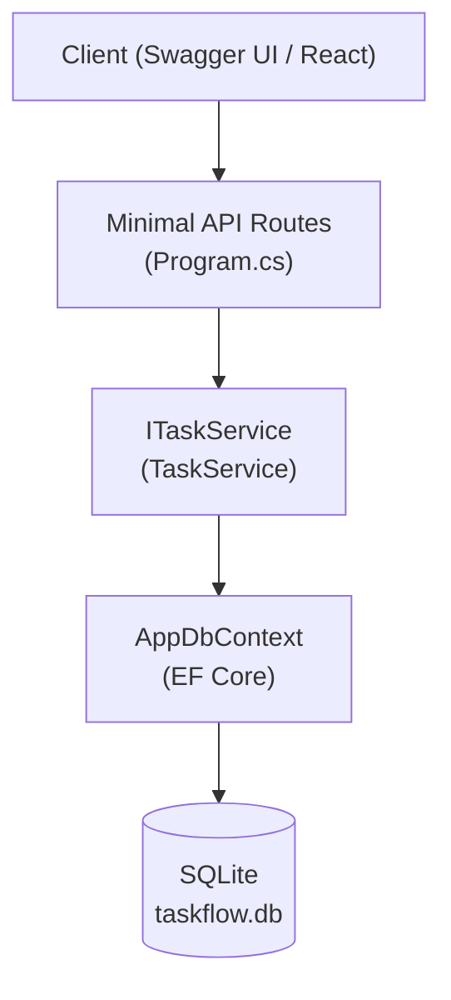
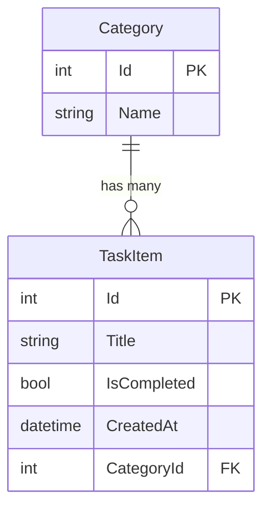

# DevDocs: TaskFlowApi — Architecture & API Reference

## Objective

Documentar a arquitetura completa do TaskFlowApi como guia técnico de referência para o plano de onboarding .NET de 4 semanas.

## Current vs Target

### Current (Week 2, Day 6)
- TaskFlowApi scaffolded com Minimal APIs
- `TaskItem` entity + `AppDbContext` + `ITaskService` + `TaskService`
- Rotas básicas: `GET /api/tasks`, `POST /api/tasks`, `DELETE /api/tasks/{id}`

### Target (Week 4, Day 20)
- Entidade `Category` com relacionamento one-to-many
- EF Core migrations aplicadas
- xUnit tests cobrindo `TaskService`
- React component conectado ao backend

---

## Architecture



---

## Project Structure

```
TaskFlowApi/
├── Models/
│   ├── TaskItem.cs
│   └── Category.cs         (added Week 4)
├── Data/
│   └── AppDbContext.cs
├── DTOs/
│   ├── TaskCreateDto.cs
│   └── TaskResponseDto.cs
├── Services/
│   ├── ITaskService.cs
│   └── TaskService.cs
├── Middleware/
│   └── RequestLoggingMiddleware.cs
├── appsettings.json
└── Program.cs
```

---

## Data Model



---

## API Reference

### GET /api/tasks

Returns all tasks ordered by `CreatedAt DESC`.

**Query Parameters:**
| Param | Type | Required | Description |
|---|---|---|---|
| categoryId | int | No | Filter by category |

**Response 200:**
```json
[
  {
    "id": 1,
    "title": "Buy groceries",
    "isCompleted": false,
    "createdAt": "2026-07-11T10:00:00Z"
  }
]
```

---

### POST /api/tasks

Creates a new task.

**Request Body:**
```json
{ "title": "Buy groceries" }
```

**Validation:**
- `title`: required, 1-200 chars (`[Required]`, `[MinLength(1)]`, `[MaxLength(200)]`)

**Response 201:** `TaskResponseDto`
**Response 400:** Validation errors when title is missing or too long

---

### DELETE /api/tasks/{id}

Deletes a task by ID.

**Response 204:** Task deleted
**Response 404:** Task not found

---

### GET /api/tasks/completed

Returns only completed tasks.

**Response 200:** `List<TaskResponseDto>` where `isCompleted == true`

---

## DI Registration (Program.cs)

```csharp
// JS equivalent: app.use((req, res, next) => { req.taskService = new TaskService(db); next(); })
builder.Services.AddScoped<ITaskService, TaskService>();
builder.Services.AddDbContext<AppDbContext>(options =>
    options.UseSqlite(builder.Configuration.GetConnectionString("DefaultConnection")));
```

## JS Parallel Reference

| .NET Concept | JS/Node.js Equivalent |
|---|---|
| `app.MapGet(...)` | `app.get(...)` (Express) |
| `ITaskService` (interface) | Service class with TypeScript interface |
| `builder.Services.AddScoped<>()` | Dependency injection container |
| `AppDbContext` | Prisma Client |
| `[Required]` attribute | Zod schema `.min(1)` |
| `dotnet ef migrations add` | `prisma migrate dev` |
| `appsettings.json` | `.env` file |

---

## Prisma Schema

Arquivo: prisma/schema.prisma

```prisma
generator client {
  provider = "prisma-client"
  output   = "../src/generated/prisma"
}

datasource db {
  provider = "postgresql"
  url      = env("DATABASE_URL")
}

model Account {
  id       String @id @default(uuid())
  name     String
  email    String @unique
  password String

  @@map("accounts")
}
```

---

## Infra: Prisma + Crypto

### Prisma helper

Arquivo: src/infra/db/prisma/helpers/prisma-helper.ts

```typescript
import { PrismaClient } from "@/generated/prisma";

export const PrismaHelper = {
  client: new PrismaClient(),

  async connect(): Promise<void> {
    await this.client.$connect();
  },

  async disconnect(): Promise<void> {
    await this.client.$disconnect();
  },
};
```

### Account repository

Arquivo: src/infra/db/prisma/account/account-prisma-repository.ts

```typescript
import { LoadAccountByEmailRepository } from "@/data/protocols/db/account/load-account-by-email-repository";
import { AccountModel } from "@/domain/models/account/account";
import { PrismaHelper } from "../helpers/prisma-helper";

export class AccountPrismaRepository implements LoadAccountByEmailRepository {
  async loadByEmail(email: string): Promise<AccountModel | null> {
    const account = await PrismaHelper.client.account.findUnique({
      where: { email },
    });

    return account;
  }
}
```

### BCrypter adapter

Arquivo: src/infra/criptography/bcrypter-adapter.ts

```typescript
import bcrypt from "bcrypt";
import { HashComparer } from "@/data/protocols/criptography/hash-comparer";

export class BCrypterAdapter implements HashComparer {
  constructor(private readonly salt: number) {}

  async compare(value: string, hash: string): Promise<boolean> {
    return bcrypt.compare(value, hash);
  }
}
```

### Jwt adapter

Arquivo: src/infra/criptography/jwt-adapter.ts

```typescript
import jwt from "jsonwebtoken";
import { Encrypter } from "@/data/protocols/criptography/encrypt";

export class JwtAdapter implements Encrypter {
  constructor(private readonly secret: string) {}

  async encrypt(value: string): Promise<string> {
    return jwt.sign({ id: value }, this.secret) as string;
  }
}
```

---

## Presentation

### Protocols

Arquivo: src/presentation/protocols/index.ts

```typescript
export type HttpRequest = {
  body?: any;
  headers?: any;
  params?: any;
  accountId?: string;
};

export type HttpResponse = {
  statusCode: number;
  body: any;
};

export interface Controller {
  handle(httpRequest: HttpRequest): Promise<HttpResponse>;
}

export interface Validation {
  validate(input: any): Error | null | undefined;
}
```

### Errors + helper

Arquivo: src/presentation/errors/missing-param-error.ts

```typescript
export class MissingParamError extends Error {
  constructor(paramName: string) {
    super(`Missing param: ${paramName}`);
    this.name = "MissingParamError";
  }
}
```

Arquivo: src/presentation/errors/invalid-param-error.ts

```typescript
export class InvalidParamError extends Error {
  constructor(paramName: string) {
    super(`Invalid param: ${paramName}`);
    this.name = "InvalidParamError";
  }
}
```

Arquivo: src/presentation/errors/unauthorized-error.ts

```typescript
export class UnauthorizedError extends Error {
  constructor() {
    super("Unauthorized");
    this.name = "UnauthorizedError";
  }
}
```

Arquivo: src/presentation/errors/server-error.ts

```typescript
export class ServerError extends Error {
  constructor(stack?: string) {
    super("Internal server error");
    this.name = "ServerError";
    this.stack = stack;
  }
}
```

Arquivo: src/presentation/helpers/http/http-helper.ts

```typescript
import { HttpResponse } from "@/presentation/protocols";
import { UnauthorizedError } from "@/presentation/errors/unauthorized-error";
import { ServerError } from "@/presentation/errors/server-error";

export const badRequest = (error: Error): HttpResponse => ({
  statusCode: 400,
  body: error,
});

export const unauthorized = (): HttpResponse => ({
  statusCode: 401,
  body: new UnauthorizedError(),
});

export const serverError = (error: Error): HttpResponse => ({
  statusCode: 500,
  body: new ServerError(error.stack),
});

export const success = (data: any): HttpResponse => ({
  statusCode: 200,
  body: data,
});
```

### Login controller

Arquivo: src/presentation/controllers/login/login-controller-protocols.ts

```typescript
export * from "@/presentation/protocols";
export * from "@/presentation/helpers/http/http-helper";
export * from "@/domain/use-cases/authentication/authentication";
```

Arquivo: src/presentation/controllers/login/login-controller.ts

```typescript
import {
  Controller,
  HttpRequest,
  HttpResponse,
  Authentication,
  Validation,
  badRequest,
  unauthorized,
  success,
  serverError,
} from "./login-controller-protocols";

export class LoginController implements Controller {
  constructor(
    private readonly authentication: Authentication,
    private readonly validation: Validation,
  ) {}

  async handle(httpRequest: HttpRequest): Promise<HttpResponse> {
    try {
      const error = this.validation.validate(httpRequest.body);
      if (error) return badRequest(error);

      const { email, password } = httpRequest.body;
      const accessToken = await this.authentication.auth({ email, password });

      if (!accessToken) return unauthorized();
      return success({ accessToken });
    } catch (error) {
      return serverError(error as Error);
    }
  }
}
```

---

## Validation

Arquivo: src/validation/validators/required-fields/required-fields.ts

```typescript
import { Validation } from "@/presentation/protocols";
import { MissingParamError } from "@/presentation/errors/missing-param-error";

export class RequiredFields implements Validation {
  constructor(private readonly fieldName: string) {}

  validate(input: any): Error | null {
    if (!input[this.fieldName]) return new MissingParamError(this.fieldName);
    return null;
  }
}
```

Arquivo: src/validation/validators/email-validation/email-validation.ts

```typescript
import { Validation } from "@/presentation/protocols";
import { InvalidParamError } from "@/presentation/errors/invalid-param-error";

export interface EmailValidator {
  isValid(email: string): boolean;
}

export class EmailValidation implements Validation {
  constructor(
    private readonly fieldName: string,
    private readonly emailValidator: EmailValidator,
  ) {}

  validate(input: any): Error | null {
    const isValid = this.emailValidator.isValid(input[this.fieldName]);
    if (!isValid) return new InvalidParamError(this.fieldName);
    return null;
  }
}
```

Arquivo: src/validation/validators/validation-composite/validation-composite.ts

```typescript
import { Validation } from "@/presentation/protocols";

export class ValidationComposite implements Validation {
  constructor(private readonly validations: Validation[]) {}

  validate(input: any): Error | null | undefined {
    for (const validation of this.validations) {
      const error = validation.validate(input);
      if (error) return error;
    }
  }
}
```

Arquivo: src/infra/adapters/email-validator-adapter.ts

```typescript
import validator from "validator";
import { EmailValidator } from "@/validation/validators/email-validation/email-validation";

export class EmailValidatorAdapter implements EmailValidator {
  isValid(email: string): boolean {
    return validator.isEmail(email);
  }
}
```

---

## Main (composition)

Arquivo: src/main/config/env.ts

```typescript
export default {
  databaseUrl: process.env.DATABASE_URL,
  port: process.env.PORT || 5050,
  jwtSecret: process.env.JWT_SECRET || "default_secret",
};
```

Arquivo: src/main/adapters/express-route-adapter.ts

```typescript
import { Request, Response } from "express";
import { Controller } from "@/presentation/protocols";

export const adaptRoute = (controller: Controller) => {
  return async (req: Request, res: Response): Promise<void> => {
    const httpRequest = { body: req.body };
    const httpResponse = await controller.handle(httpRequest);

    if (httpResponse.statusCode >= 200 && httpResponse.statusCode <= 299) {
      res.status(httpResponse.statusCode).json(httpResponse.body);
      return;
    }

    res
      .status(httpResponse.statusCode)
      .json({ error: httpResponse.body.message });
  };
};
```

Arquivo: src/main/factories/usecases/authentication/db-authentication-factory.ts

```typescript
import { DbAuthentication } from "@/data/use-cases/authentication/db-authentication";
import { BCrypterAdapter } from "@/infra/criptography/bcrypter-adapter";
import { JwtAdapter } from "@/infra/criptography/jwt-adapter";
import { AccountPrismaRepository } from "@/infra/db/prisma/account/account-prisma-repository";
import env from "@/main/config/env";

export const makeDbAuthentication = (): DbAuthentication => {
  return new DbAuthentication(
    new AccountPrismaRepository(),
    new BCrypterAdapter(12),
    new JwtAdapter(env.jwtSecret),
  );
};
```

Arquivo: src/main/factories/controllers/login/login-validation-factory.ts

```typescript
import { ValidationComposite } from "@/validation/validators/validation-composite/validation-composite";
import { RequiredFields } from "@/validation/validators/required-fields/required-fields";
import { EmailValidation } from "@/validation/validators/email-validation/email-validation";
import { EmailValidatorAdapter } from "@/infra/adapters/email-validator-adapter";

export const makeLoginValidation = (): ValidationComposite => {
  return new ValidationComposite([
    new RequiredFields("email"),
    new RequiredFields("password"),
    new EmailValidation("email", new EmailValidatorAdapter()),
  ]);
};
```

Arquivo: src/main/factories/controllers/login/login-controller-factory.ts

```typescript
import { LoginController } from "@/presentation/controllers/login/login-controller";
import { makeDbAuthentication } from "@/main/factories/usecases/authentication/db-authentication-factory";
import { makeLoginValidation } from "./login-validation-factory";

export const makeLoginController = (): LoginController => {
  return new LoginController(makeDbAuthentication(), makeLoginValidation());
};
```

Arquivo: src/main/routes/login/login-routes.ts

```typescript
import { Router } from "express";
import { adaptRoute } from "@/main/adapters/express-route-adapter";
import { makeLoginController } from "@/main/factories/controllers/login/login-controller-factory";

export default (router: Router): void => {
  router.post("/login", adaptRoute(makeLoginController()));
};
```

Arquivo: src/main/config/routes.ts

```typescript
import { Express, Router } from "express";
import setupLoginRoutes from "@/main/routes/login/login-routes";

export const setupRoutes = async (app: Express): Promise<void> => {
  const router = Router();
  app.use("/api", router);
  setupLoginRoutes(router);
};
```

Arquivo: src/main/config/app.ts

```typescript
import express, { Express } from "express";
import { setupRoutes } from "@/main/config/routes";

export const setupApp = async (): Promise<Express> => {
  const app = express();
  app.use(express.json());
  await setupRoutes(app);
  return app;
};
```

Arquivo: src/main/server.ts

```typescript
import { PrismaHelper } from "@/infra/db/prisma/helpers/prisma-helper";
import env from "@/main/config/env";

PrismaHelper.connect()
  .then(async () => {
    const { setupApp } = await import("@/main/config/app");
    const app = await setupApp();

    app.listen(env.port, () => {
      console.log(`Server running at http://localhost:${env.port}`);
    });
  })
  .catch(console.error);
```

---

## TDD: ordem obrigatoria (RED -> GREEN)

1. `src/data/use-cases/authentication/db-authentication.spec.ts` (ja existe)
2. `src/presentation/controllers/login/login-controller.spec.ts`
3. `src/validation/validators/required-fields/required-fields.spec.ts`
4. `src/validation/validators/email-validation/email-validation.spec.ts`
5. `src/validation/validators/validation-composite/validation-composite.spec.ts`
6. `src/infra/criptography/bcrypter-adapter.spec.ts`
7. `src/infra/criptography/jwt-adapter.spec.ts`
8. `src/infra/db/prisma/account/account-prisma-repository.spec.ts`

Observacao: camada `main` e apenas composicao, sem testes diretos (YAGNI).

---

## Testes que faltavam na doc

### 1) LoginController unit test

Arquivo: `src/presentation/controllers/login/login-controller.spec.ts`

```typescript
import { describe, expect, jest, test } from "@jest/globals";
import { LoginController } from "./login-controller";
import {
  Authentication,
  AuthenticationParams,
} from "@/domain/use-cases/authentication/authentication";
import { Validation } from "@/presentation/protocols";
import { MissingParamError } from "@/presentation/errors/missing-param-error";

const makeAuthentication = (): Authentication => {
  class AuthenticationStub implements Authentication {
    async auth(params: AuthenticationParams): Promise<string | null> {
      return "any_token";
    }
  }
  return new AuthenticationStub();
};

const makeValidation = (): Validation => {
  class ValidationStub implements Validation {
    validate(input: any): Error | null | undefined {
      return null;
    }
  }
  return new ValidationStub();
};

const makeSut = () => {
  const authenticationStub = makeAuthentication();
  const validationStub = makeValidation();
  const sut = new LoginController(authenticationStub, validationStub);
  return { sut, authenticationStub, validationStub };
};

describe("LoginController", () => {
  test("should return 400 if validation fails", async () => {
    const { sut, validationStub } = makeSut();
    jest
      .spyOn(validationStub, "validate")
      .mockReturnValueOnce(new MissingParamError("email"));

    const httpResponse = await sut.handle({
      body: { email: "any_email@mail.com", password: "any_password" },
    });

    expect(httpResponse.statusCode).toBe(400);
  });

  test("should return 401 if authentication returns null", async () => {
    const { sut, authenticationStub } = makeSut();
    jest.spyOn(authenticationStub, "auth").mockResolvedValueOnce(null);

    const httpResponse = await sut.handle({
      body: { email: "any_email@mail.com", password: "any_password" },
    });

    expect(httpResponse.statusCode).toBe(401);
  });

  test("should return 200 on success", async () => {
    const { sut } = makeSut();
    const httpResponse = await sut.handle({
      body: { email: "any_email@mail.com", password: "any_password" },
    });

    expect(httpResponse.statusCode).toBe(200);
    expect(httpResponse.body).toEqual({ accessToken: "any_token" });
  });
});
```

### 2) RequiredFields validator unit test

Arquivo: `src/validation/validators/required-fields/required-fields.spec.ts`

```typescript
import { describe, expect, test } from "@jest/globals";
import { RequiredFields } from "./required-fields";
import { MissingParamError } from "@/presentation/errors/missing-param-error";

describe("RequiredFields", () => {
  test("should return MissingParamError if field is missing", () => {
    const sut = new RequiredFields("email");
    const error = sut.validate({});
    expect(error).toEqual(new MissingParamError("email"));
  });

  test("should return null if field is present", () => {
    const sut = new RequiredFields("email");
    const error = sut.validate({ email: "any_email@mail.com" });
    expect(error).toBeNull();
  });
});
```

### 3) EmailValidation validator unit test

Arquivo: `src/validation/validators/email-validation/email-validation.spec.ts`

```typescript
import { describe, expect, jest, test } from "@jest/globals";
import { EmailValidation } from "./email-validation";
import { InvalidParamError } from "@/presentation/errors/invalid-param-error";

const makeEmailValidatorStub = () => ({
  isValid: jest.fn().mockReturnValue(true),
});

describe("EmailValidation", () => {
  test("should return InvalidParamError if email is invalid", () => {
    const emailValidatorStub = makeEmailValidatorStub();
    emailValidatorStub.isValid.mockReturnValueOnce(false);
    const sut = new EmailValidation("email", emailValidatorStub);

    const error = sut.validate({ email: "invalid_email" });
    expect(error).toEqual(new InvalidParamError("email"));
  });

  test("should call EmailValidator with correct email", () => {
    const emailValidatorStub = makeEmailValidatorStub();
    const sut = new EmailValidation("email", emailValidatorStub);
    sut.validate({ email: "any_email@mail.com" });
    expect(emailValidatorStub.isValid).toHaveBeenCalledWith(
      "any_email@mail.com",
    );
  });
});
```

### 4) ValidationComposite unit test

Arquivo: `src/validation/validators/validation-composite/validation-composite.spec.ts`

```typescript
import { describe, expect, test } from "@jest/globals";
import { ValidationComposite } from "./validation-composite";
import { Validation } from "@/presentation/protocols";

const makeValidationStub = (error?: Error): Validation => ({
  validate: () => error,
});

describe("ValidationComposite", () => {
  test("should return first error", () => {
    const firstError = new Error("first_error");
    const sut = new ValidationComposite([
      makeValidationStub(firstError),
      makeValidationStub(new Error("second_error")),
    ]);

    const error = sut.validate({});
    expect(error).toBe(firstError);
  });

  test("should return undefined if all validations pass", () => {
    const sut = new ValidationComposite([
      makeValidationStub(),
      makeValidationStub(),
    ]);

    const error = sut.validate({});
    expect(error).toBeUndefined();
  });
});
```

### 5) BCrypterAdapter unit test

Arquivo: `src/infra/criptography/bcrypter-adapter.spec.ts`

```typescript
import { describe, expect, test } from "@jest/globals";
import bcrypt from "bcrypt";
import { BCrypterAdapter } from "./bcrypter-adapter";

describe("BCrypterAdapter", () => {
  test("should return true when compare succeeds", async () => {
    const sut = new BCrypterAdapter(12);
    const hash = await bcrypt.hash("any_password", 12);
    const isValid = await sut.compare("any_password", hash);
    expect(isValid).toBe(true);
  });

  test("should return false when compare fails", async () => {
    const sut = new BCrypterAdapter(12);
    const hash = await bcrypt.hash("any_password", 12);
    const isValid = await sut.compare("wrong_password", hash);
    expect(isValid).toBe(false);
  });
});
```

### 6) JwtAdapter unit test

Arquivo: `src/infra/criptography/jwt-adapter.spec.ts`

```typescript
import { describe, expect, jest, test } from "@jest/globals";
import jwt from "jsonwebtoken";
import { JwtAdapter } from "./jwt-adapter";

describe("JwtAdapter", () => {
  test("should call sign with correct values", async () => {
    const sut = new JwtAdapter("secret");
    const signSpy = jest.spyOn(jwt, "sign");

    await sut.encrypt("any_id");

    expect(signSpy).toHaveBeenCalledWith({ id: "any_id" }, "secret");
  });

  test("should throw if sign throws", async () => {
    const sut = new JwtAdapter("secret");
    jest.spyOn(jwt, "sign").mockImplementationOnce(() => {
      throw new Error();
    });

    await expect(sut.encrypt("any_id")).rejects.toThrow();
  });
});
```

### 7) AccountPrismaRepository integration test

Arquivo: `src/infra/db/prisma/account/account-prisma-repository.spec.ts`

```typescript
import {
  afterAll,
  afterEach,
  beforeAll,
  describe,
  expect,
  test,
} from "@jest/globals";
import { PrismaHelper } from "../helpers/prisma-helper";
import { AccountPrismaRepository } from "./account-prisma-repository";

describe("AccountPrismaRepository", () => {
  beforeAll(async () => {
    await PrismaHelper.connect();
  });

  afterAll(async () => {
    await PrismaHelper.disconnect();
  });

  afterEach(async () => {
    await PrismaHelper.client.account.deleteMany();
  });

  test("should return account on success", async () => {
    await PrismaHelper.client.account.create({
      data: {
        name: "any_name",
        email: "any_email@mail.com",
        password: "hashed_password",
      },
    });

    const sut = new AccountPrismaRepository();
    const account = await sut.loadByEmail("any_email@mail.com");

    expect(account).toBeTruthy();
    expect(account?.email).toBe("any_email@mail.com");
  });

  test("should return null if email does not exist", async () => {
    const sut = new AccountPrismaRepository();
    const account = await sut.loadByEmail("missing@mail.com");
    expect(account).toBeNull();
  });
});
```

---

## Testability Checklist

1. Unit test de DbAuthentication passa.
2. Unit tests de adapters (BCrypterAdapter, JwtAdapter) passam.
3. Integration test de AccountPrismaRepository passa com banco de teste.
4. Controller retorna:
   - 200 com { accessToken } para credencial valida
   - 401 para credencial invalida
   - 400 para payload invalido
5. DATABASE_URL e JWT_SECRET definidos.
6. Prisma client gerado e migration aplicada.

---

## Commands

```bash
npm install express bcrypt jsonwebtoken validator @prisma/client
npm install --save-dev prisma @types/express @types/bcrypt @types/jsonwebtoken @types/validator jest ts-jest
npx prisma generate
npx prisma migrate dev --name create_accounts
```
