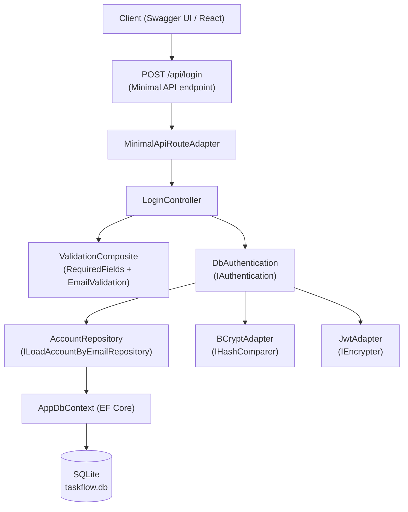
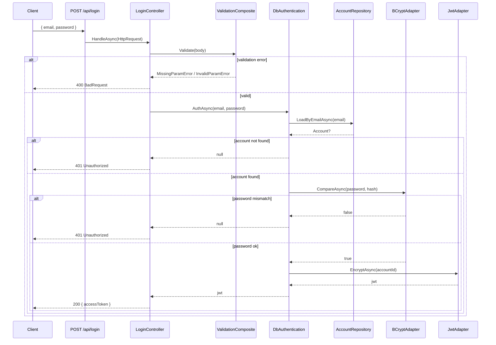
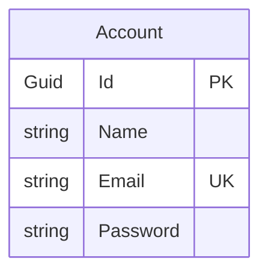

# DevDocs: Auth API — POST /api/login

## Objective

Documentar a implementação do endpoint `POST /api/login` em .NET 8 (ASP.NET Core Minimal APIs + EF Core), seguindo Clean Architecture: autentica um usuário via email/senha e retorna um JWT.

## Escopo

Este documento cobre **apenas o fluxo de autenticação**. Endpoints de tasks/categorias vivem em outra doc.

Camadas envolvidas:
- **Domain**: contrato `IAuthentication` + `AuthenticationParams`
- **Data**: use case `DbAuthentication` (orquestra load + compare + encrypt)
- **Infra**: `AccountRepository` (EF Core), `BCryptAdapter`, `JwtAdapter`, `EmailValidatorAdapter`
- **Presentation**: `LoginController`, DTOs, validators, http helpers
- **Main**: composição (`Program.cs`, factories, route mapping)

---

## Architecture



---

## Login Flow (sequence)



---

## Project Structure (auth slice)

```
TaskFlowApi/
├── Domain/
│   └── UseCases/
│       └── IAuthentication.cs
├── Data/
│   ├── Protocols/
│   │   ├── ILoadAccountByEmailRepository.cs
│   │   ├── IHashComparer.cs
│   │   └── IEncrypter.cs
│   └── UseCases/
│       └── DbAuthentication.cs
├── Infra/
│   ├── Db/
│   │   └── AccountRepository.cs
│   ├── Cryptography/
│   │   ├── BCryptAdapter.cs
│   │   └── JwtAdapter.cs
│   └── Adapters/
│       └── EmailValidatorAdapter.cs
├── Presentation/
│   ├── Protocols/HttpProtocols.cs
│   ├── Errors/
│   │   ├── MissingParamError.cs
│   │   ├── InvalidParamError.cs
│   │   ├── UnauthorizedError.cs
│   │   └── ServerError.cs
│   ├── Helpers/HttpHelper.cs
│   └── Controllers/Login/
│       ├── LoginRequestDto.cs
│       └── LoginController.cs
├── Validation/
│   └── Validators/
│       ├── RequiredFields.cs
│       ├── EmailValidation.cs
│       └── ValidationComposite.cs
├── Main/
│   ├── Adapters/MinimalApiRouteAdapter.cs
│   ├── Factories/
│   │   ├── UseCases/DbAuthenticationFactory.cs
│   │   └── Controllers/Login/
│   │       ├── LoginValidationFactory.cs
│   │       └── LoginControllerFactory.cs
│   └── Routes/LoginRoutes.cs
├── Models/
│   └── Account.cs
├── Data/AppDbContext.cs
├── appsettings.json
└── Program.cs
```

---

## Data Model (auth)



Constraints:
- `Email` único (`HasIndex(...).IsUnique()`)
- `Password` armazena o hash BCrypt (nunca plaintext)

---

## API Reference

### POST /api/login

Autentica um usuário e retorna um JWT.

**Request Body:**
```json
{
  "email": "user@mail.com",
  "password": "s3cret!"
}
```

**Validation:**
- `email`: obrigatório, formato válido
- `password`: obrigatório

**Response 200:**
```json
{ "accessToken": "eyJhbGciOiJIUzI1NiIsInR5cCI6..." }
```

**Response 400:** payload inválido (`MissingParamError` / `InvalidParamError`)
**Response 401:** email não encontrado ou senha incorreta
**Response 500:** erro interno (`ServerError`)

---

## DI Registration (resumo)

```csharp
builder.Services.AddDbContext<AppDbContext>(o =>
    o.UseSqlite(builder.Configuration.GetConnectionString("DefaultConnection")));

builder.Services.AddScoped<ILoadAccountByEmailRepository, AccountRepository>();
builder.Services.AddSingleton<IHashComparer>(_ => new BCryptAdapter(workFactor: 12));
builder.Services.AddSingleton<IEncrypter>(_ =>
    new JwtAdapter(builder.Configuration["Jwt:Secret"]!));
builder.Services.AddScoped<IAuthentication, DbAuthentication>();
```

## JS Parallel Reference

| .NET Concept | JS/Node.js Equivalent |
|---|---|
| `app.MapPost("/api/login", ...)` | `app.post("/login", ...)` (Express) |
| `IAuthentication` (interface) | `Authentication` TS interface |
| `builder.Services.AddScoped<>()` | Manual composition / DI container |
| `AppDbContext` + `DbSet<Account>` | Prisma Client + `account` model |
| `BCrypt.Net-Next` | `bcrypt` npm package |
| `System.IdentityModel.Tokens.Jwt` | `jsonwebtoken` npm package |
| `[EmailAddress]` / `EmailAddressAttribute` | `validator.isEmail(...)` |
| `appsettings.json` + user-secrets | `.env` |

---

## EF Core Model + DbContext

Arquivo: `TaskFlowApi/Models/Account.cs`

```csharp
// TS equivalente: os "attributes" ([Table], [Key], [Required]) sao como decorators
// do TypeORM (@Entity, @PrimaryKey, @Column). O EF Core le esses metadados
// via reflection para montar o schema do banco.
using System.ComponentModel.DataAnnotations;         // [Required], [MaxLength], [Key]
using System.ComponentModel.DataAnnotations.Schema;  // [Table]

// Namespace = pasta logica do projeto. Nao existe "export" por arquivo
// como em TS; a visibilidade eh controlada por public/internal/private.
namespace TaskFlowApi.Models;

[Table("accounts")] // Mapeia a classe para a tabela "accounts" (equivalente ao @@map do Prisma)
public class Account
{
    // Guid = UUID em .NET. Diferente do TS onde voce usaria `string`,
    // aqui o tipo eh forte e serializado como string em JSON.
    [Key]
    public Guid Id { get; set; } = Guid.NewGuid();

    // { get; set; } eh uma "auto-property" (equivale a getter/setter
    // implicitos em TS/JS). O "= string.Empty" evita warning de nullable.
    [Required]
    [MaxLength(200)]
    public string Name { get; set; } = string.Empty;

    // Nao ha @unique aqui; a constraint UNIQUE eh definida no OnModelCreating
    // do DbContext (proximo bloco). Poderia usar Fluent API tambem no OnModelCreating.
    [Required]
    [MaxLength(320)]
    public string Email { get; set; } = string.Empty;

    // IMPORTANTE: guarda o HASH da senha, nunca o plaintext.
    // O hashing acontece no BCryptAdapter na hora do cadastro/mudanca de senha.
    [Required]
    public string Password { get; set; } = string.Empty;
}
```

Arquivo: `TaskFlowApi/Data/AppDbContext.cs` (apenas o slice relevante para auth)

```csharp
using Microsoft.EntityFrameworkCore;
using TaskFlowApi.Models;

namespace TaskFlowApi.Data;

// DbContext eh o equivalente ao PrismaClient: ponto central de acesso ao banco,
// tracking de entidades e execucao de queries LINQ traduzidas para SQL.
public class AppDbContext : DbContext
{
    // Construtor recebe as options via DI (connection string, provider, etc.).
    // ": base(options)" chama o construtor da classe base (super() em JS).
    public AppDbContext(DbContextOptions<AppDbContext> options) : base(options) { }

    // DbSet<T> eh a "tabela" tipada. Em Prisma: `prisma.account.*`.
    // A expressao "=> Set<Account>()" eh uma expression-bodied property (arrow-like).
    public DbSet<Account> Accounts => Set<Account>();

    // OnModelCreating = onde configuramos schema via Fluent API
    // (equivalente a mexer no schema.prisma via codigo).
    // "protected override" indica que estamos sobrescrevendo o metodo da classe base.
    protected override void OnModelCreating(ModelBuilder modelBuilder)
    {
        // HasIndex + IsUnique = constraint UNIQUE no Email.
        // Equivalente a `email String @unique` no Prisma.
        modelBuilder.Entity<Account>()
            .HasIndex(a => a.Email)
            .IsUnique();
    }
}
```

Migration:

```bash
dotnet ef migrations add CreateAccounts
dotnet ef database update
```

---

## Infra: Repository + Crypto

### Load account contract

Arquivo: `TaskFlowApi/Data/Protocols/ILoadAccountByEmailRepository.cs`

```csharp
using TaskFlowApi.Models;

namespace TaskFlowApi.Data.Protocols;

// Convencao .NET: interfaces comecam com "I" (ILoadAccountByEmailRepository).
// Em TS voce escreveria "interface LoadAccountByEmailRepository".
public interface ILoadAccountByEmailRepository
{
    // Task<T>  === Promise<T>  do TS.
    // Account? === Account | null  (o "?" faz parte dos Nullable Reference Types).
    // CancellationToken = idiomatico em .NET para permitir cancelar operacoes async
    // (ex: request foi abortado). Nao tem equivalente direto em TS/Node.
    Task<Account?> LoadByEmailAsync(string email, CancellationToken ct = default);
}
```

### Account repository (EF Core)

Arquivo: `TaskFlowApi/Infra/Db/AccountRepository.cs`

```csharp
using Microsoft.EntityFrameworkCore;
using TaskFlowApi.Data;
using TaskFlowApi.Data.Protocols;
using TaskFlowApi.Models;

namespace TaskFlowApi.Infra.Db;

// ": ILoadAccountByEmailRepository" = "implements" do TS.
// Uma classe pode herdar de UMA classe base + implementar VARIAS interfaces.
public class AccountRepository : ILoadAccountByEmailRepository
{
    // Convencao: campo privado com prefixo underscore (_db).
    // "readonly" = so pode ser atribuido no construtor (equivale a `readonly` do TS).
    private readonly AppDbContext _db;

    // Construtor com "=>" (expression-bodied): equivale a
    //   constructor(db) { this._db = db; }
    // O AppDbContext eh injetado automaticamente pelo container de DI.
    public AccountRepository(AppDbContext db) => _db = db;

    // AsNoTracking() = otimizacao: nao rastreia mudancas na entidade
    // (nao vamos fazer UPDATE, so ler). Sem isso o EF Core guarda snapshot.
    // FirstOrDefaultAsync = LINQ: retorna 1o resultado ou null.
    //   Prisma equivalente: prisma.account.findUnique({ where: { email } })
    // A expressao "a => a.Email == email" eh uma Expression<Func<>>,
    // que o EF Core TRADUZ para SQL (WHERE email = @email), nao roda em memoria.
    public Task<Account?> LoadByEmailAsync(string email, CancellationToken ct = default)
        => _db.Accounts.AsNoTracking().FirstOrDefaultAsync(a => a.Email == email, ct);
}
```

### Hash comparer contract + BCrypt adapter

Arquivo: `TaskFlowApi/Data/Protocols/IHashComparer.cs`

```csharp
namespace TaskFlowApi.Data.Protocols;

// Contrato abstrato para comparar senha vs hash.
// A ideia (DIP): a camada de dominio nao depende de "bcrypt", depende de
// IHashComparer. Amanha, se quisermos trocar por Argon2, so trocamos o adapter.
public interface IHashComparer
{
    Task<bool> CompareAsync(string value, string hash);
}
```

Arquivo: `TaskFlowApi/Infra/Cryptography/BCryptAdapter.cs`

```csharp
using TaskFlowApi.Data.Protocols;

namespace TaskFlowApi.Infra.Cryptography;

// Package NuGet: BCrypt.Net-Next (equivalente ao npm `bcrypt`).
// Este adapter isola a dependencia externa: o resto do codigo so conhece IHashComparer.
public class BCryptAdapter : IHashComparer
{
    // workFactor = custo do algoritmo (2^workFactor rounds).
    // 12 eh o valor padrao seguro em 2026. Equivale ao 2o parametro de bcrypt.hash(pwd, 12).
    private readonly int _workFactor;

    public BCryptAdapter(int workFactor) => _workFactor = workFactor;

    // BCrypt.Net.Verify eh SINCRONO em C# (diferente do bcrypt do Node, que expoe promise).
    // Envolvemos em Task.FromResult para respeitar a assinatura async do contrato,
    // sem gastar uma thread do pool a toa.
    public Task<bool> CompareAsync(string value, string hash)
        => Task.FromResult(BCrypt.Net.BCrypt.Verify(value, hash));
}
```

### Encrypter contract + JWT adapter

Arquivo: `TaskFlowApi/Data/Protocols/IEncrypter.cs`

```csharp
namespace TaskFlowApi.Data.Protocols;

// Abstracao para "criar token". Nome generico proposital: quem implementa
// pode ser JWT hoje, Paseto amanha. O dominio nao precisa saber.
public interface IEncrypter
{
    Task<string> EncryptAsync(string value);
}
```

Arquivo: `TaskFlowApi/Infra/Cryptography/JwtAdapter.cs`

```csharp
// System.IdentityModel.Tokens.Jwt eh o equivalente ao pacote `jsonwebtoken` do Node.
using System.IdentityModel.Tokens.Jwt;   // JwtSecurityToken, JwtSecurityTokenHandler
using System.Security.Claims;             // Claim (par chave/valor dentro do payload)
using System.Text;                        // Encoding.UTF8
using Microsoft.IdentityModel.Tokens;     // SymmetricSecurityKey, SigningCredentials
using TaskFlowApi.Data.Protocols;

namespace TaskFlowApi.Infra.Cryptography;

public class JwtAdapter : IEncrypter
{
    private readonly string _secret;

    public JwtAdapter(string secret) => _secret = secret;

    // Em TS: jwt.sign({ id: value }, secret)
    // Em .NET a API eh mais verbosa porque JWT eh so um caso de uso de
    // uma stack maior de tokens (Microsoft.IdentityModel).
    public Task<string> EncryptAsync(string value)
    {
        // 1) Chave simetrica a partir do segredo (mesmo segredo assina e valida).
        //    Precisa ter >= 32 bytes para HS256 (senao lanca excecao).
        var key = new SymmetricSecurityKey(Encoding.UTF8.GetBytes(_secret));

        // 2) Algoritmo de assinatura HMAC-SHA256 (equivalente ao "HS256" do jsonwebtoken).
        var creds = new SigningCredentials(key, SecurityAlgorithms.HmacSha256);

        // 3) Monta o token com um claim { id: value } no payload.
        //    Claim = par chave/valor dentro do JWT (parte publica, decodificavel).
        var token = new JwtSecurityToken(
            claims: new[] { new Claim("id", value) },
            signingCredentials: creds);

        // 4) Serializa para o formato compacto "xxx.yyy.zzz".
        //    Task.FromResult porque a operacao eh sincrona mas o contrato eh async.
        return Task.FromResult(new JwtSecurityTokenHandler().WriteToken(token));
    }
}
```

---

## Domain: Authentication use case

Arquivo: `TaskFlowApi/Domain/UseCases/IAuthentication.cs`

```csharp
namespace TaskFlowApi.Domain.UseCases;

// "record" = tipo imutavel com value-equality automatica.
// Equivale a um "type AuthenticationParams = { email: string; password: string }"
// do TS, mas com igualdade estrutural gratis (a == b compara campos).
public record AuthenticationParams(string Email, string Password);

// Contrato do use case. A camada de Presentation (controller) depende dessa
// abstracao, nunca da implementacao concreta (DbAuthentication).
public interface IAuthentication
{
    // Retorna o token JWT (string) ou null se as credenciais forem invalidas.
    Task<string?> AuthAsync(AuthenticationParams parameters);
}
```

Arquivo: `TaskFlowApi/Data/UseCases/DbAuthentication.cs`

```csharp
using TaskFlowApi.Data.Protocols;
using TaskFlowApi.Domain.UseCases;

namespace TaskFlowApi.Data.UseCases;

// Use case = orquestra os "protocols" (repository + crypto adapters).
// Nao conhece EF Core, nao conhece BCrypt, nao conhece JWT.
// Isso eh o principio de Dependency Inversion na pratica.
public class DbAuthentication : IAuthentication
{
    private readonly ILoadAccountByEmailRepository _loadAccount;
    private readonly IHashComparer _hashComparer;
    private readonly IEncrypter _encrypter;

    // 3 dependencias injetadas via construtor (constructor injection).
    // Em TS voce faria: constructor(private loadAccount, private hashComparer, ...)
    public DbAuthentication(
        ILoadAccountByEmailRepository loadAccount,
        IHashComparer hashComparer,
        IEncrypter encrypter)
    {
        _loadAccount = loadAccount;
        _hashComparer = hashComparer;
        _encrypter = encrypter;
    }

    // Fluxo classico de autenticacao:
    public async Task<string?> AuthAsync(AuthenticationParams parameters)
    {
        // 1) Busca a conta pelo email. Se nao existir, retorna null (=> 401).
        //    "is null" (pattern matching) eh a forma idiomatica em C# moderno.
        var account = await _loadAccount.LoadByEmailAsync(parameters.Email);
        if (account is null) return null;

        // 2) Compara a senha enviada com o hash salvo. Se nao bater, null (=> 401).
        var isValid = await _hashComparer.CompareAsync(parameters.Password, account.Password);
        if (!isValid) return null;

        // 3) Gera o JWT contendo o id da conta. Guid -> string (por ser JSON-safe).
        return await _encrypter.EncryptAsync(account.Id.ToString());
    }
}
```

---

## Presentation

### Protocols

Arquivo: `TaskFlowApi/Presentation/Protocols/HttpProtocols.cs`

```csharp
namespace TaskFlowApi.Presentation.Protocols;

// Estes tipos sao "framework-agnostic": o LoginController nao sabe se esta
// rodando em Minimal API, MVC ou console. O adapter converte HttpContext -> HttpRequest.
// Equivalente ao padrao da stack TS (rmanguinho): HttpRequest / HttpResponse proprios.
public class HttpRequest
{
    // "object?" = qualquer coisa ou null (equivale a `any | null` em TS).
    // Preferimos object aqui para nao acoplar o controller a um tipo especifico.
    public object? Body { get; set; }
    public IDictionary<string, string>? Headers { get; set; }
    public IDictionary<string, string>? Params { get; set; }
    public string? AccountId { get; set; }
}

public class HttpResponse
{
    public int StatusCode { get; set; }
    public object? Body { get; set; }
}

// Contrato de controller. Todo controller vai receber HttpRequest e devolver HttpResponse.
// Testar controller vira trivial: nao precisa mockar HttpContext do ASP.NET Core.
public interface IController
{
    Task<HttpResponse> HandleAsync(HttpRequest httpRequest);
}

// Contrato de validator. Retorna Exception? = erro ou null (sem erro).
// Usamos Exception como tipo de retorno (nao para throw!) porque encapsula
// mensagem + tipo. Poderia ser um ValidationError custom, mas Exception basta.
public interface IValidation
{
    Exception? Validate(object? input);
}
```

### Errors + helper

Arquivo: `TaskFlowApi/Presentation/Errors/MissingParamError.cs`

```csharp
namespace TaskFlowApi.Presentation.Errors;

// Exception customizada. Em TS: `class MissingParamError extends Error`.
// ": base(...)" chama o construtor da classe base (Exception) passando a mensagem.
public class MissingParamError : Exception
{
    public MissingParamError(string paramName) : base($"Missing param: {paramName}") { }
}
```

Arquivo: `TaskFlowApi/Presentation/Errors/InvalidParamError.cs`

```csharp
namespace TaskFlowApi.Presentation.Errors;

// Usado quando o parametro esta presente mas mal-formatado (ex: email invalido).
public class InvalidParamError : Exception
{
    public InvalidParamError(string paramName) : base($"Invalid param: {paramName}") { }
}
```

Arquivo: `TaskFlowApi/Presentation/Errors/UnauthorizedError.cs`

```csharp
namespace TaskFlowApi.Presentation.Errors;

public class UnauthorizedError : Exception
{
    public UnauthorizedError() : base("Unauthorized") { }
}
```

Arquivo: `TaskFlowApi/Presentation/Errors/ServerError.cs`

```csharp
namespace TaskFlowApi.Presentation.Errors;

public class ServerError : Exception
{
    public ServerError(string? stack = null) : base("Internal server error")
    {
        if (stack is not null) Data["Stack"] = stack;
    }
}
```

Arquivo: `TaskFlowApi/Presentation/Helpers/HttpHelper.cs`

```csharp
using TaskFlowApi.Presentation.Errors;
using TaskFlowApi.Presentation.Protocols;

namespace TaskFlowApi.Presentation.Helpers;

// Classe estatica = so contem metodos utilitarios, nao pode ser instanciada.
// Equivale a um modulo de funcoes puras em TS: `export const badRequest = ...`.
public static class HttpHelper
{
    // "new()" = target-typed new expression (C# 9+). O compilador infere o tipo
    // pelo retorno declarado (HttpResponse). Mais enxuto que `new HttpResponse { ... }`.
    public static HttpResponse BadRequest(Exception error) => new()
    {
        StatusCode = 400,
        Body = error
    };

    public static HttpResponse Unauthorized() => new()
    {
        StatusCode = 401,
        Body = new UnauthorizedError()
    };

    public static HttpResponse ServerError(Exception error) => new()
    {
        StatusCode = 500,
        // StackTrace so eh preenchido depois que a exception eh lancada e capturada.
        Body = new ServerError(error.StackTrace)
    };

    public static HttpResponse Success(object data) => new()
    {
        StatusCode = 200,
        Body = data
    };
}
```

### Login DTO + Controller

Arquivo: `TaskFlowApi/Presentation/Controllers/Login/LoginRequestDto.cs`

```csharp
namespace TaskFlowApi.Presentation.Controllers.Login;

// DTO = Data Transfer Object. Espelha o shape do JSON que chega no body.
// O ASP.NET Core faz o binding automatico usando System.Text.Json
// (equivalente ao JSON.parse + validacao de shape do Zod).
// Campos sao string? porque, antes de validar, podem chegar ausentes.
public class LoginRequestDto
{
    public string? Email { get; set; }
    public string? Password { get; set; }
}
```

Arquivo: `TaskFlowApi/Presentation/Controllers/Login/LoginController.cs`

```csharp
using TaskFlowApi.Domain.UseCases;
using TaskFlowApi.Presentation.Helpers;
using TaskFlowApi.Presentation.Protocols;

namespace TaskFlowApi.Presentation.Controllers.Login;

// Controller nao chama EF Core, BCrypt ou JWT diretamente.
// Ele orquestra: valida input -> chama use case -> traduz o resultado em HTTP.
public class LoginController : IController
{
    private readonly IAuthentication _authentication;
    private readonly IValidation _validation;

    public LoginController(IAuthentication authentication, IValidation validation)
    {
        _authentication = authentication;
        _validation = validation;
    }

    public async Task<HttpResponse> HandleAsync(HttpRequest httpRequest)
    {
        // try/catch aqui eh a "ultima linha de defesa": qualquer excecao nao esperada
        // vira 500 ServerError, evitando vazar stack trace pro cliente.
        try
        {
            // 1) Valida antes de bater no banco. Falhou? 400.
            var error = _validation.Validate(httpRequest.Body);
            if (error is not null) return HttpHelper.BadRequest(error);

            // 2) Cast explicito: o adapter (Main/Adapters) garante que Body eh LoginRequestDto.
            //    O "!" eh null-forgiving: dizemos ao compilador "confie, nao eh null aqui".
            var dto = (LoginRequestDto)httpRequest.Body!;

            // 3) Chama o use case. Se retornar null, credenciais invalidas => 401.
            var accessToken = await _authentication.AuthAsync(
                new AuthenticationParams(dto.Email!, dto.Password!));

            if (accessToken is null) return HttpHelper.Unauthorized();

            // 4) Sucesso: objeto anonimo `new { accessToken }` vira `{ "accessToken": "..." }`
            //    na serializacao (camelCase por padrao no ASP.NET Core).
            return HttpHelper.Success(new { accessToken });
        }
        catch (Exception ex)
        {
            return HttpHelper.ServerError(ex);
        }
    }
}
```

---

## Validation

Arquivo: `TaskFlowApi/Validation/Validators/RequiredFields.cs`

```csharp
using System.Reflection;
using TaskFlowApi.Presentation.Errors;
using TaskFlowApi.Presentation.Protocols;

namespace TaskFlowApi.Validation.Validators;

// Em TS: `input[fieldName]` funciona nativo (objeto = dicionario).
// Em C# um objeto tipado nao suporta indexing por string, entao usamos
// Reflection para ler a propriedade cujo nome foi passado no construtor.
public class RequiredFields : IValidation
{
    private readonly string _fieldName;

    public RequiredFields(string fieldName) => _fieldName = fieldName;

    public Exception? Validate(object? input)
    {
        if (input is null) return new MissingParamError(_fieldName);

        // GetType() = pega o tipo em runtime. GetProperty(nome, flags) = busca a property.
        // IgnoreCase permite passar "email" e casar com "Email" (convencao PascalCase C#).
        var prop = input.GetType().GetProperty(
            _fieldName,
            BindingFlags.IgnoreCase | BindingFlags.Public | BindingFlags.Instance);

        // "as string" = cast seguro: se nao for string, retorna null (nao lanca).
        var value = prop?.GetValue(input) as string;

        // IsNullOrWhiteSpace cobre null, "" e "   " de uma vez.
        if (string.IsNullOrWhiteSpace(value)) return new MissingParamError(_fieldName);

        return null;
    }
}
```

Arquivo: `TaskFlowApi/Validation/Validators/EmailValidation.cs`

```csharp
using System.Reflection;
using TaskFlowApi.Presentation.Errors;
using TaskFlowApi.Presentation.Protocols;

namespace TaskFlowApi.Validation.Validators;

// Interface separada porque quem valida email formato eh um adapter externo.
// Mantem o EmailValidation testavel sem depender de biblioteca real.
public interface IEmailValidator
{
    bool IsValid(string email);
}

public class EmailValidation : IValidation
{
    private readonly string _fieldName;
    private readonly IEmailValidator _emailValidator;

    public EmailValidation(string fieldName, IEmailValidator emailValidator)
    {
        _fieldName = fieldName;
        _emailValidator = emailValidator;
    }

    public Exception? Validate(object? input)
    {
        // Mesma tecnica de reflection do RequiredFields.
        // "input?.GetType()" = null-conditional: se input for null, prop tambem eh null.
        var prop = input?.GetType().GetProperty(
            _fieldName,
            BindingFlags.IgnoreCase | BindingFlags.Public | BindingFlags.Instance);

        // "?? string.Empty" = null-coalescing: se der null, usa "" (equivale ao ?? do TS).
        var email = prop?.GetValue(input) as string ?? string.Empty;

        // Ternario: valido -> null (sem erro), invalido -> InvalidParamError.
        return _emailValidator.IsValid(email) ? null : new InvalidParamError(_fieldName);
    }
}
```

Arquivo: `TaskFlowApi/Validation/Validators/ValidationComposite.cs`

```csharp
using TaskFlowApi.Presentation.Protocols;

namespace TaskFlowApi.Validation.Validators;

// Composite pattern: combina varios IValidation em um so.
// Roda cada validacao em sequencia; retorna o PRIMEIRO erro encontrado (fail-fast).
public class ValidationComposite : IValidation
{
    // IReadOnlyList<T> = lista imutavel do lado externo (nao expoe Add/Remove).
    private readonly IReadOnlyList<IValidation> _validations;

    // IEnumerable<T> = sequencia iteravel (aceita array, List, LINQ).
    // Equivale a receber `Iterable<T>` em TS. .ToList() materializa para nao
    // reavaliar a sequencia se ela for lazy (ex: um LINQ query).
    public ValidationComposite(IEnumerable<IValidation> validations)
        => _validations = validations.ToList();

    public Exception? Validate(object? input)
    {
        // foreach eh a versao C# do for...of do JS.
        foreach (var validation in _validations)
        {
            var error = validation.Validate(input);
            if (error is not null) return error; // fail-fast
        }
        return null;
    }
}
```

Arquivo: `TaskFlowApi/Infra/Adapters/EmailValidatorAdapter.cs`

```csharp
using System.ComponentModel.DataAnnotations;
using TaskFlowApi.Validation.Validators;

namespace TaskFlowApi.Infra.Adapters;

// Ao inves de instalar `validator` (npm), aproveitamos EmailAddressAttribute da BCL
// (Base Class Library). Ele faz uma validacao pragmatica de email (nao RFC-perfeita,
// mas suficiente pra 99% dos casos, igual `validator.isEmail`).
public class EmailValidatorAdapter : IEmailValidator
{
    public bool IsValid(string email)
    {
        if (string.IsNullOrWhiteSpace(email)) return false;

        // Instanciamos o attribute e chamamos IsValid (metodo publico dele).
        // Sim, o attribute funciona fora de contextos de validacao automatica.
        return new EmailAddressAttribute().IsValid(email);
    }
}
```

---

## Main (composition)

Arquivo: `TaskFlowApi/appsettings.json`

```json
{
  "ConnectionStrings": {
    "DefaultConnection": "Data Source=taskflow.db"
  },
  "Jwt": {
    "Secret": "change-me-in-production"
  },
  "Kestrel": {
    "Endpoints": {
      "Http": { "Url": "http://localhost:5050" }
    }
  }
}
```

Arquivo: `TaskFlowApi/Main/Adapters/MinimalApiRouteAdapter.cs`

```csharp
using Microsoft.AspNetCore.Http;
using TaskFlowApi.Presentation.Protocols;

namespace TaskFlowApi.Main.Adapters;

// Adapter que traduz Minimal API <-> nossa abstracao IController.
// Equivalente ao "adaptRoute" do rmanguinho para Express.
public static class MinimalApiRouteAdapter
{
    // Func<TBody, Task<IResult>> = tipo de uma funcao que recebe TBody e retorna Task<IResult>.
    // Equivale a: (body: TBody) => Promise<IResult> em TS.
    // "where TBody : class" = restringe TBody a ser tipo de referencia (nao valor).
    public static Func<TBody, Task<IResult>> Adapt<TBody>(IController controller)
        where TBody : class
    {
        // Retorna uma "lambda async": o Minimal API vai chamar essa funcao
        // quando bater no endpoint. O ASP.NET Core resolve TBody via model binding.
        return async (TBody body) =>
        {
            // Empacota o body no nosso HttpRequest generico.
            var httpRequest = new Presentation.Protocols.HttpRequest { Body = body };
            var httpResponse = await controller.HandleAsync(httpRequest);

            // Pattern matching: "StatusCode is >= 200 and <= 299" checa faixa (2xx).
            if (httpResponse.StatusCode is >= 200 and <= 299)
                return Results.Json(httpResponse.Body, statusCode: httpResponse.StatusCode);

            // Erros: extrai a mensagem da Exception para nao vazar o objeto inteiro.
            // "body as Exception" = null se nao for Exception. "?.Message ?? "Error"" garante fallback.
            var message = (httpResponse.Body as Exception)?.Message ?? "Error";
            return Results.Json(new { error = message }, statusCode: httpResponse.StatusCode);
        };
    }
}
```

Arquivo: `TaskFlowApi/Main/Factories/UseCases/DbAuthenticationFactory.cs`

```csharp
using TaskFlowApi.Data.Protocols;
using TaskFlowApi.Data.UseCases;

namespace TaskFlowApi.Main.Factories.UseCases;

// Factory: centraliza a montagem do use case. Se um dia o DbAuthentication
// ganhar mais dependencias, so essa factory muda (o resto do codigo nao).
// Equivalente aos makeXxx do padrao rmanguinho em TS.
public static class DbAuthenticationFactory
{
    public static DbAuthentication Make(
        ILoadAccountByEmailRepository loadAccount,
        IHashComparer hashComparer,
        IEncrypter encrypter)
        => new(loadAccount, hashComparer, encrypter); // target-typed new
}
```

Arquivo: `TaskFlowApi/Main/Factories/Controllers/Login/LoginValidationFactory.cs`

```csharp
using TaskFlowApi.Infra.Adapters;
using TaskFlowApi.Validation.Validators;

namespace TaskFlowApi.Main.Factories.Controllers.Login;

// Factory que monta o pipeline de validacoes do login.
// Ordem importa: RequiredFields(Email) -> RequiredFields(Password) -> EmailValidation.
// Assim email vazio dispara MissingParamError antes de InvalidParamError.
public static class LoginValidationFactory
{
    public static ValidationComposite Make() => new(new IValidation[]
    {
        new RequiredFields("Email"),
        new RequiredFields("Password"),
        new EmailValidation("Email", new EmailValidatorAdapter())
    });
}
```

Arquivo: `TaskFlowApi/Main/Factories/Controllers/Login/LoginControllerFactory.cs`

```csharp
using TaskFlowApi.Domain.UseCases;
using TaskFlowApi.Presentation.Controllers.Login;

namespace TaskFlowApi.Main.Factories.Controllers.Login;

// Factory de controller: recebe o IAuthentication (resolvido pelo DI)
// e injeta a validation montada pela LoginValidationFactory.
public static class LoginControllerFactory
{
    public static LoginController Make(IAuthentication authentication)
        => new(authentication, LoginValidationFactory.Make());
}
```

Arquivo: `TaskFlowApi/Main/Routes/LoginRoutes.cs`

```csharp
using TaskFlowApi.Domain.UseCases;
using TaskFlowApi.Main.Adapters;
using TaskFlowApi.Main.Factories.Controllers.Login;
using TaskFlowApi.Presentation.Controllers.Login;

namespace TaskFlowApi.Main.Routes;

// Extension methods (o "this" no 1o parametro) permitem escrever
//   app.MapLoginRoutes();
// como se fosse metodo nativo do IEndpointRouteBuilder.
// Equivale a monkey-patchar um Router em TS, mas com type-safety.
public static class LoginRoutes
{
    public static void MapLoginRoutes(this IEndpointRouteBuilder app)
    {
        // MapPost eh o equivalente ao `app.post(...)` do Express.
        // Os parametros da lambda (LoginRequestDto body, IAuthentication auth)
        // sao injetados pelo Minimal API: body vem do JSON, auth vem do container DI.
        app.MapPost("/api/login", async (LoginRequestDto body, IAuthentication auth) =>
        {
            // A cada request criamos o controller (via factory) com as dependencias.
            // O adapter converte para o formato de retorno do Minimal API (IResult).
            var controller = LoginControllerFactory.Make(auth);
            var handler = MinimalApiRouteAdapter.Adapt<LoginRequestDto>(controller);
            return await handler(body);
        });
    }
}
```

Arquivo: `TaskFlowApi/Program.cs`

```csharp
using Microsoft.EntityFrameworkCore;
using TaskFlowApi.Data;
using TaskFlowApi.Data.Protocols;
using TaskFlowApi.Data.UseCases;
using TaskFlowApi.Domain.UseCases;
using TaskFlowApi.Infra.Cryptography;
using TaskFlowApi.Infra.Db;
using TaskFlowApi.Main.Routes;

// Program.cs em .NET 8 usa "top-level statements": nao precisa de class Program { Main(...) }.
// Equivale ao seu `src/main/server.ts` de entrada.
var builder = WebApplication.CreateBuilder(args);

// -------- Registro de servicos no container de DI --------
// Ciclos de vida:
//   AddSingleton  = 1 instancia para a vida toda do processo (equivalente a singleton em TS).
//   AddScoped     = 1 instancia por request HTTP (util para DbContext, repositorios).
//   AddTransient  = nova instancia a cada resolucao.

// Persistence: DbContext eh scoped por padrao (uma UnitOfWork por request).
builder.Services.AddDbContext<AppDbContext>(options =>
    options.UseSqlite(builder.Configuration.GetConnectionString("DefaultConnection")));

// Cryptography adapters: singleton eh ok porque sao stateless.
// A lambda "_ => new ..." ignora o service provider; poderia receber `sp` para resolver deps.
builder.Services.AddSingleton<IHashComparer>(_ => new BCryptAdapter(workFactor: 12));
builder.Services.AddSingleton<IEncrypter>(_ =>
    new JwtAdapter(builder.Configuration["Jwt:Secret"]!));

// Repositories: scoped porque dependem do AppDbContext (que eh scoped).
// Regra: um servico nao pode ter lifetime maior que suas dependencias.
builder.Services.AddScoped<ILoadAccountByEmailRepository, AccountRepository>();

// Use cases: scoped por composicao (dependem do repository scoped).
builder.Services.AddScoped<IAuthentication, DbAuthentication>();

// Swagger (OpenAPI) para explorar a API no browser: http://localhost:5050/swagger
builder.Services.AddEndpointsApiExplorer();
builder.Services.AddSwaggerGen();

var app = builder.Build();

app.UseSwagger();
app.UseSwaggerUI();

// Registra as rotas de login (extension method que criamos em Main/Routes/LoginRoutes.cs).
app.MapLoginRoutes();

app.Run(); // Sobe o Kestrel e bloqueia (equivale a `app.listen(port)` do Express).
```

---

## TDD: ordem obrigatoria (RED -> GREEN)

1. `TaskFlowApi.Tests/Data/UseCases/DbAuthenticationTests.cs` (ja existe)
2. `TaskFlowApi.Tests/Presentation/Controllers/Login/LoginControllerTests.cs`
3. `TaskFlowApi.Tests/Validation/Validators/RequiredFieldsTests.cs`
4. `TaskFlowApi.Tests/Validation/Validators/EmailValidationTests.cs`
5. `TaskFlowApi.Tests/Validation/Validators/ValidationCompositeTests.cs`
6. `TaskFlowApi.Tests/Infra/Cryptography/BCryptAdapterTests.cs`
7. `TaskFlowApi.Tests/Infra/Cryptography/JwtAdapterTests.cs`
8. `TaskFlowApi.Tests/Infra/Db/AccountRepositoryTests.cs`

Observacao: camada `Main` e apenas composicao, sem testes diretos (YAGNI).

Stack de testes: **xUnit** + **Moq** + **FluentAssertions** + `Microsoft.EntityFrameworkCore.InMemory` (ou SQLite em memoria para o repositorio).

### Mapeamento Jest -> xUnit + Moq + FluentAssertions

| Jest (TS) | xUnit + Moq + FluentAssertions |
|---|---|
| `describe("X", ...)` | `public class XTests` (classe = suite) |
| `test("...", ...)` / `it(...)` | `[Fact] public void MyTest()` |
| `test.each([...])` | `[Theory] [InlineData(...)]` |
| `beforeEach` | construtor da classe de teste |
| `afterEach` | `IDisposable.Dispose()` |
| `beforeAll` / `afterAll` | `IAsyncLifetime.InitializeAsync/DisposeAsync` |
| `jest.fn()` / stub manual | `new Mock<IX>()` |
| `mockFn.mockReturnValue(x)` | `mock.Setup(m => m.Method(...)).Returns(x)` |
| `mockFn.mockResolvedValue(x)` | `mock.Setup(...).ReturnsAsync(x)` |
| `expect(x).toBe(y)` | `x.Should().Be(y)` |
| `expect(fn).toHaveBeenCalledWith(a)` | `mock.Verify(m => m.Method(a), Times.Once)` |

---

## Testes que faltavam na doc

### 1) LoginController unit test

Arquivo: `TaskFlowApi.Tests/Presentation/Controllers/Login/LoginControllerTests.cs`

```csharp
using FluentAssertions;   // .Should().Be(...)  (expect(x).toBe(y))
using Moq;                // Mock<T>, It.IsAny, Setup, Verify
using TaskFlowApi.Domain.UseCases;
using TaskFlowApi.Presentation.Controllers.Login;
using TaskFlowApi.Presentation.Errors;
using TaskFlowApi.Presentation.Protocols;
using Xunit;              // [Fact], [Theory]

namespace TaskFlowApi.Tests.Presentation.Controllers.Login;

public class LoginControllerTests
{
    // Helper equivalente ao makeSut() do padrao TS.
    // Retorna uma tupla (sut, mocks) para o teste desestruturar.
    // "static" porque nao usa estado da classe de teste.
    private static (LoginController sut, Mock<IAuthentication> authMock, Mock<IValidation> validationMock) MakeSut()
    {
        // Mock<T> = cria um proxy de IAuthentication. Todos os metodos retornam default
        // ate serem "programados" via Setup(...) (equivale ao jest.fn() + mockReturnValue).
        var authMock = new Mock<IAuthentication>();
        authMock.Setup(a => a.AuthAsync(It.IsAny<AuthenticationParams>()))
                .ReturnsAsync("any_token"); // ReturnsAsync = mockResolvedValue

        var validationMock = new Mock<IValidation>();
        validationMock.Setup(v => v.Validate(It.IsAny<object>())).Returns((Exception?)null);

        // .Object = instancia real que implementa a interface (para injetar no SUT).
        var sut = new LoginController(authMock.Object, validationMock.Object);
        return (sut, authMock, validationMock);
    }

    private static HttpRequest MakeRequest() => new()
    {
        Body = new LoginRequestDto { Email = "any_email@mail.com", Password = "any_password" }
    };

    // [Fact] = teste simples sem parametros (equivale a `test(...)` do Jest).
    // Para testes parametrizados use [Theory] + [InlineData].
    [Fact]
    public async Task Should_Return_400_If_Validation_Fails()
    {
        // Desestruturacao de tupla; "_" descarta o valor (nao usamos authMock aqui).
        var (sut, _, validationMock) = MakeSut();

        // Sobrescreve o setup padrao (que retornava null) so pra este teste.
        validationMock.Setup(v => v.Validate(It.IsAny<object>()))
                      .Returns(new MissingParamError("email"));

        var response = await sut.HandleAsync(MakeRequest());

        // FluentAssertions: leitura natural, mensagens de erro melhores que Assert.Equal.
        response.StatusCode.Should().Be(400);
    }

    [Fact]
    public async Task Should_Return_401_If_Authentication_Returns_Null()
    {
        var (sut, authMock, _) = MakeSut();

        // Simula credencial invalida: AuthAsync retorna null.
        authMock.Setup(a => a.AuthAsync(It.IsAny<AuthenticationParams>()))
                .ReturnsAsync((string?)null);

        var response = await sut.HandleAsync(MakeRequest());

        response.StatusCode.Should().Be(401);
    }

    [Fact]
    public async Task Should_Return_200_On_Success()
    {
        // Setup padrao ja simula sucesso; nao precisa mexer nos mocks.
        var (sut, _, _) = MakeSut();

        var response = await sut.HandleAsync(MakeRequest());

        response.StatusCode.Should().Be(200);
        // BeEquivalentTo = comparacao estrutural (ignora tipo, olha propriedades).
        // Perfeito para objetos anonimos (new { accessToken = ... }).
        response.Body.Should().BeEquivalentTo(new { accessToken = "any_token" });
    }
}
```

### 2) RequiredFields validator unit test

Arquivo: `TaskFlowApi.Tests/Validation/Validators/RequiredFieldsTests.cs`

```csharp
using FluentAssertions;
using TaskFlowApi.Presentation.Errors;
using TaskFlowApi.Validation.Validators;
using Xunit;

namespace TaskFlowApi.Tests.Validation.Validators;

public class RequiredFieldsTests
{
    // `record` = classe imutavel enxuta. Perfeito para fixtures de teste
    // (equivale a `type Input = { email: string | null }` em TS).
    private record Input(string? Email);

    [Fact]
    public void Should_Return_MissingParamError_If_Field_Is_Missing()
    {
        var sut = new RequiredFields("Email");
        var error = sut.Validate(new Input(null));

        // BeOfType<T>() = valida tipo concreto (nao aceita subclasses).
        // Use BeAssignableTo<T>() se quiser aceitar heranca.
        error.Should().BeOfType<MissingParamError>();
    }

    [Fact]
    public void Should_Return_Null_If_Field_Is_Present()
    {
        var sut = new RequiredFields("Email");
        var error = sut.Validate(new Input("any_email@mail.com"));
        error.Should().BeNull();
    }
}
```

### 3) EmailValidation validator unit test

Arquivo: `TaskFlowApi.Tests/Validation/Validators/EmailValidationTests.cs`

```csharp
using FluentAssertions;
using Moq;
using TaskFlowApi.Presentation.Errors;
using TaskFlowApi.Validation.Validators;
using Xunit;

namespace TaskFlowApi.Tests.Validation.Validators;

public class EmailValidationTests
{
    private record Input(string Email);

    [Fact]
    public void Should_Return_InvalidParamError_If_Email_Is_Invalid()
    {
        // Mockamos o IEmailValidator para NAO depender da implementacao real
        // (EmailAddressAttribute). Esse teste valida a LOGICA da classe EmailValidation,
        // nao a qualidade do parser de email. Ha teste separado do adapter.
        var validatorMock = new Mock<IEmailValidator>();
        validatorMock.Setup(v => v.IsValid(It.IsAny<string>())).Returns(false);

        var sut = new EmailValidation("Email", validatorMock.Object);
        var error = sut.Validate(new Input("invalid_email"));

        error.Should().BeOfType<InvalidParamError>();
    }

    [Fact]
    public void Should_Call_EmailValidator_With_Correct_Email()
    {
        var validatorMock = new Mock<IEmailValidator>();
        validatorMock.Setup(v => v.IsValid(It.IsAny<string>())).Returns(true);

        var sut = new EmailValidation("Email", validatorMock.Object);
        sut.Validate(new Input("any_email@mail.com"));

        // Verify + Times.Once = jest: expect(spy).toHaveBeenCalledWith(...).
        // Confere que o valor extraido via reflection chegou correto no adapter.
        validatorMock.Verify(v => v.IsValid("any_email@mail.com"), Times.Once);
    }
}
```

### 4) ValidationComposite unit test

Arquivo: `TaskFlowApi.Tests/Validation/Validators/ValidationCompositeTests.cs`

```csharp
using FluentAssertions;
using Moq;
using TaskFlowApi.Presentation.Protocols;
using TaskFlowApi.Validation.Validators;
using Xunit;

namespace TaskFlowApi.Tests.Validation.Validators;

public class ValidationCompositeTests
{
    // Helper que cria um IValidation "programavel" (retorna o erro que passarmos, ou null).
    // Equivale ao makeValidationStub do padrao TS.
    private static Mock<IValidation> MakeStub(Exception? error = null)
    {
        var mock = new Mock<IValidation>();
        mock.Setup(v => v.Validate(It.IsAny<object>())).Returns(error);
        return mock;
    }

    [Fact]
    public void Should_Return_First_Error()
    {
        var firstError = new Exception("first_error");
        var sut = new ValidationComposite(new[]
        {
            MakeStub(firstError).Object,
            MakeStub(new Exception("second_error")).Object
        });

        var error = sut.Validate(new { });

        // BeSameAs = comparacao por REFERENCIA (equivalente a `toBe` do Jest).
        // Garante que o composite parou na 1a e nao construiu outra Exception.
        error.Should().BeSameAs(firstError);
    }

    [Fact]
    public void Should_Return_Null_If_All_Validations_Pass()
    {
        var sut = new ValidationComposite(new[]
        {
            MakeStub().Object,
            MakeStub().Object
        });

        var error = sut.Validate(new { });

        error.Should().BeNull();
    }
}
```

### 5) BCryptAdapter unit test

Arquivo: `TaskFlowApi.Tests/Infra/Cryptography/BCryptAdapterTests.cs`

```csharp
using FluentAssertions;
using TaskFlowApi.Infra.Cryptography;
using Xunit;

namespace TaskFlowApi.Tests.Infra.Cryptography;

public class BCryptAdapterTests
{
    // Sem mock aqui de proposito: testamos que o adapter integra corretamente
    // com a biblioteca BCrypt real. Se mockassemos, nao pegariamos regressoes
    // de versao / mudanca de API do BCrypt.Net-Next.
    [Fact]
    public async Task Should_Return_True_When_Compare_Succeeds()
    {
        var sut = new BCryptAdapter(workFactor: 12);
        // Hasheamos com a mesma lib usada pelo adapter, mas via API estatica.
        var hash = BCrypt.Net.BCrypt.HashPassword("any_password", 12);

        var isValid = await sut.CompareAsync("any_password", hash);

        isValid.Should().BeTrue();
    }

    [Fact]
    public async Task Should_Return_False_When_Compare_Fails()
    {
        var sut = new BCryptAdapter(workFactor: 12);
        var hash = BCrypt.Net.BCrypt.HashPassword("any_password", 12);

        var isValid = await sut.CompareAsync("wrong_password", hash);

        isValid.Should().BeFalse();
    }
}
```

### 6) JwtAdapter unit test

Arquivo: `TaskFlowApi.Tests/Infra/Cryptography/JwtAdapterTests.cs`

```csharp
using System.IdentityModel.Tokens.Jwt;
using FluentAssertions;
using TaskFlowApi.Infra.Cryptography;
using Xunit;

namespace TaskFlowApi.Tests.Infra.Cryptography;

public class JwtAdapterTests
{
    [Fact]
    public async Task Should_Return_Token_With_Correct_Claim()
    {
        // HS256 exige chave de >= 256 bits (32 bytes UTF-8) = 32 caracteres ASCII.
        var sut = new JwtAdapter("a-very-long-secret-key-32-chars!!");

        var token = await sut.EncryptAsync("any_id");
        // ReadJwtToken decodifica (nao valida assinatura) so para inspecionar payload.
        var parsed = new JwtSecurityTokenHandler().ReadJwtToken(token);

        // Verifica que o claim { id: "any_id" } esta presente.
        parsed.Claims.Should().Contain(c => c.Type == "id" && c.Value == "any_id");
    }

    [Fact]
    public async Task Should_Throw_If_Secret_Is_Too_Short()
    {
        // Chave curta demais: SymmetricSecurityKey deve lancar.
        var sut = new JwtAdapter("short");

        // Lambda que NAO executa ainda (`() => ...`). Passamos para o Should()
        // para que o FluentAssertions capture a excecao ao invocar.
        // Em Jest: `await expect(fn).rejects.toThrow()`.
        var act = () => sut.EncryptAsync("any_id");

        await act.Should().ThrowAsync<Exception>();
    }
}
```

### 7) AccountRepository integration test

Arquivo: `TaskFlowApi.Tests/Infra/Db/AccountRepositoryTests.cs`

```csharp
using FluentAssertions;
using Microsoft.EntityFrameworkCore;
using TaskFlowApi.Data;
using TaskFlowApi.Infra.Db;
using TaskFlowApi.Models;
using Xunit;

namespace TaskFlowApi.Tests.Infra.Db;

public class AccountRepositoryTests : IAsyncLifetime
{
    // IAsyncLifetime = ciclo de vida assincrono por classe:
    //   InitializeAsync = antes de cada teste (equivalente ao beforeEach do Jest).
    //   DisposeAsync    = depois de cada teste (equivalente ao afterEach).
    //
    // "null!" = "prometo ao compilador que sera inicializado". Evita warning
    // de nullable no campo antes do InitializeAsync rodar.
    private AppDbContext _db = null!;

    public Task InitializeAsync()
    {
        // InMemoryDatabase = provider de teste do EF Core (nao roda SQL de verdade).
        // Cada teste ganha um DB unico via Guid.NewGuid() para nao vazar estado.
        // Alternativa mais fiel: `.UseSqlite("DataSource=:memory:")` (roda SQL real).
        var options = new DbContextOptionsBuilder<AppDbContext>()
            .UseInMemoryDatabase(databaseName: Guid.NewGuid().ToString())
            .Options;

        _db = new AppDbContext(options);
        return Task.CompletedTask; // Task equivalente a Promise.resolve()
    }

    public Task DisposeAsync()
    {
        _db.Dispose(); // libera recursos (equivalente a client.$disconnect do Prisma)
        return Task.CompletedTask;
    }

    [Fact]
    public async Task Should_Return_Account_On_Success()
    {
        // Arrange: popula o banco com uma conta.
        _db.Accounts.Add(new Account
        {
            Name = "any_name",
            Email = "any_email@mail.com",
            Password = "hashed_password"
        });
        await _db.SaveChangesAsync(); // commit (equivalente ao prisma.$transaction commit)

        var sut = new AccountRepository(_db);
        var account = await sut.LoadByEmailAsync("any_email@mail.com");

        account.Should().NotBeNull();
        account!.Email.Should().Be("any_email@mail.com");
    }

    [Fact]
    public async Task Should_Return_Null_If_Email_Does_Not_Exist()
    {
        var sut = new AccountRepository(_db);
        var account = await sut.LoadByEmailAsync("missing@mail.com");
        account.Should().BeNull();
    }
}
```

---

## Testability Checklist

1. Unit test de `DbAuthentication` passa.
2. Unit tests de adapters (`BCryptAdapter`, `JwtAdapter`) passam.
3. Integration test de `AccountRepository` passa com `UseInMemoryDatabase` (ou SQLite em memoria).
4. Controller retorna:
   - 200 com `{ accessToken }` para credencial valida
   - 401 para credencial invalida
   - 400 para payload invalido
5. `ConnectionStrings:DefaultConnection` e `Jwt:Secret` definidos em `appsettings.json` / user-secrets.
6. Migration `CreateAccounts` gerada e aplicada.

---

## Commands

```bash
# Runtime dependencies (TaskFlowApi.csproj)
dotnet add package Microsoft.EntityFrameworkCore.Sqlite
dotnet add package Microsoft.EntityFrameworkCore.Design
dotnet add package BCrypt.Net-Next
dotnet add package System.IdentityModel.Tokens.Jwt
dotnet add package Swashbuckle.AspNetCore

# Test project (TaskFlowApi.Tests.csproj)
dotnet add package xunit
dotnet add package xunit.runner.visualstudio
dotnet add package Moq
dotnet add package FluentAssertions
dotnet add package Microsoft.EntityFrameworkCore.InMemory

# EF Core migrations
dotnet ef migrations add CreateAccounts
dotnet ef database update

# Store JWT secret outside source control
dotnet user-secrets init
dotnet user-secrets set "Jwt:Secret" "a-very-long-secret-key-at-least-32-chars"
```
