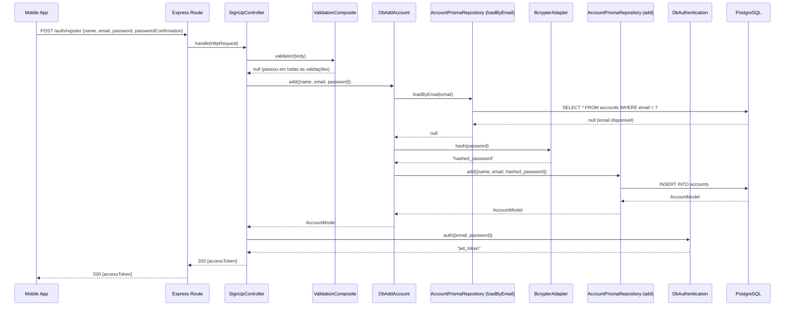

# DevDocs: TaskFlowApi — EF Core Data Layer (Week 4)

## Objective

Documentar a implementação completa da camada de dados do TaskFlowApi com EF Core + SQLite, cobrindo as tarefas do Dia 16 ao 19 do plano de onboarding .NET.

## Current vs Target

### Current (end of Week 3)
- `TaskItem` entity com campos básicos
- `AppDbContext` com `DbSet<TaskItem>`
- Banco criado via `EnsureCreated()` (ok para desenvolvimento inicial)

### Target (end of Week 4)
- `Category` entity com relacionamento one-to-many com `TaskItem`
- EF Core migrations substituindo `EnsureCreated()`
- Queries com `.Include()` para carregamento de dados relacionados
- xUnit tests com in-memory provider

---

## Entities

### TaskItem.cs

```csharp
// Models/TaskItem.cs
public class TaskItem
{
    public int Id { get; set; }

    [Required]
    [MaxLength(200)]
    public string Title { get; set; } = string.Empty;

    public bool IsCompleted { get; set; } = false;

    public DateTime CreatedAt { get; set; } = DateTime.UtcNow;

    // FK — nullable (task may not have a category)
    public int? CategoryId { get; set; }
    public Category? Category { get; set; }  // Navigation property
}
```

### Category.cs

```csharp
// Models/Category.cs
public class Category
{
    public int Id { get; set; }

    [Required]
    [MaxLength(100)]
    public string Name { get; set; } = string.Empty;

    // Navigation property — one-to-many
    public ICollection<TaskItem> Tasks { get; set; } = new List<TaskItem>();
}
```

---

## AppDbContext.cs

```csharp
// Data/AppDbContext.cs
public class AppDbContext : DbContext
{
    public AppDbContext(DbContextOptions<AppDbContext> options) : base(options) { }

    public DbSet<TaskItem> Tasks => Set<TaskItem>();
    public DbSet<Category> Categories => Set<Category>();

    protected override void OnModelCreating(ModelBuilder modelBuilder)
    {
        // Category name must be unique
        modelBuilder.Entity<Category>()
            .HasIndex(c => c.Name)
            .IsUnique();

        // TaskItem → Category: DeleteBehavior.SetNull (don't cascade delete tasks)
        modelBuilder.Entity<TaskItem>()
            .HasOne(t => t.Category)
            .WithMany(c => c.Tasks)
            .HasForeignKey(t => t.CategoryId)
            .OnDelete(DeleteBehavior.SetNull);
    }
}
```

---

## Migrations (Day 17)

```bash
# = prisma migrate dev --name CategoryAdded
dotnet ef migrations add CategoryAdded

# = prisma migrate deploy
dotnet ef database update
```

The generated migration file will be in `Migrations/` folder. Read it — it's just SQL wrapped in C#.

---

## Queries with .Include() (Day 18)

```csharp
// = Prisma: findMany({ include: { category: true } })
var tasks = await _db.Tasks
    .Where(t => t.CategoryId == categoryId)
    .Include(t => t.Category)
    .Select(t => new TaskResponseDto(
        t.Id,
        t.Title,
        t.IsCompleted,
        t.CreatedAt,
        t.Category != null ? t.Category.Name : null
    ))
    .AsNoTracking()
    .ToListAsync();
```

---

## xUnit Tests (Day 19)

```csharp
// Tests/TaskServiceTests.cs
public class TaskServiceTests
{
    private AppDbContext CreateInMemoryContext()
    {
        var options = new DbContextOptionsBuilder<AppDbContext>()
            .UseInMemoryDatabase(Guid.NewGuid().ToString())
            .Options;
        return new AppDbContext(options);
    }

    [Fact]
    public async Task CreateTask_HappyPath_ShouldPersistAndReturn()
    {
        var svc = new TaskService(CreateInMemoryContext());
        var result = await svc.CreateAsync(new TaskCreateDto { Title = "Buy milk" });
        Assert.NotNull(result);
        Assert.Equal("Buy milk", result.Title);
        Assert.False(result.IsCompleted);
    }

    [Fact]
    public async Task GetById_WhenNotFound_ShouldReturnNull()
    {
        var svc = new TaskService(CreateInMemoryContext());
        var result = await svc.GetByIdAsync(999);
        Assert.Null(result);
    }

    [Fact]
    public async Task DeleteTask_ShouldRemoveFromDb()
    {
        var ctx = CreateInMemoryContext();
        var svc = new TaskService(ctx);
        var created = await svc.CreateAsync(new TaskCreateDto { Title = "Delete me" });
        var deleted = await svc.DeleteAsync(created.Id);
        Assert.True(deleted);
        Assert.Null(await svc.GetByIdAsync(created.Id));
    }
}
```

---

## JS Parallel: EF Core vs Prisma

| EF Core | Prisma |
|---|---|
| `AppDbContext` | `PrismaClient` |
| `DbSet<TaskItem>` | `prisma.task` |
| `_db.Tasks.Add(entity)` | `prisma.task.create({ data: {...} })` |
| `_db.Tasks.FindAsync(id)` | `prisma.task.findUnique({ where: { id } })` |
| `.Include(t => t.Category)` | `include: { category: true }` |
| `await _db.SaveChangesAsync()` | (auto-committed per operation in Prisma) |
| `dotnet ef migrations add X` | `prisma migrate dev --name X` |
| `EF Core InMemory provider` | Jest in-memory SQLite |
 Após registro bem-sucedido, o usuário é autenticado automaticamente e recebe um JWT token.

## Current vs Target

### Current

- ✅ POST /auth/login implementado com validação, autenticação e JWT
- ✅ Prisma configurado com model Account (id, name, email, password)
- ✅ DbAuthentication use case (login)
- ✅ BcrypterAdapter implementa HashComparer
- ✅ JwtAdapter implementa Encrypter
- ✅ AccountPrismaRepository implementa LoadAccountByEmailRepository
- ✅ LoginController com validation composite
- ✅ Validators: RequiredFields, EmailValidation, ValidationComposite

### Target

- 🎯 POST /auth/register
- 🎯 Validação: name, email, password, passwordConfirmation (required + email format + password match)
- 🎯 Verificar email duplicado → 403 EmailInUseError
- 🎯 Hash de senha antes de salvar
- 🎯 Persistir Account no Prisma
- 🎯 Auto-login: retornar JWT token após registro
- 🎯 Responses: 200 `{ accessToken }`, 400 (validation), 403 (email in use), 500 (server error)

---

## Prisma Schema

**Nenhuma mudança necessária.** O schema atual já suporta a feature:

```prisma
model Account {
  id       String @id @default(uuid())
  name     String
  email    String @unique
  password String
  @@map("accounts")
}
```

- `@unique` no email garante constraint de duplicação no banco
- Campos suficientes para armazenar os dados do registro

---

## Domain

> **Por que `src/domain/`?**
> É a camada mais interna da Clean Architecture — não depende de nada externo.
> Contém apenas contratos (interfaces e tipos) que expressam **o que** o sistema faz, sem nenhum detalhe de como.
> Nenhuma outra camada pode "contaminar" o domain com detalhes de banco, HTTP ou framework.

### AddAccount interface (use case contract)

> **Por que `use-cases/add-account/`?**
> `use-cases/` agrupa os contratos das operações que o sistema expõe para o mundo externo.
> Cada pasta representa um caso de uso isolado (`add-account`, `authentication`, etc.).
> O arquivo `add-account.ts` define a interface `AddAccount` e o tipo `AddAccountParams` — o contrato que qualquer camada pode depender sem saber nada sobre banco ou bcrypt.

Arquivo: `src/domain/use-cases/add-account/add-account.ts`

```typescript
import { AccountModel } from "../../models/account/account";

export type AddAccountParams = {
  name: string;
  email: string;
  password: string;
};

export interface AddAccount {
  add(params: AddAccountParams): Promise<AccountModel | null>;
}
```

---

## Data

> **Por que `src/data/`?**
> É a camada que implementa os casos de uso do domain e define os protocolos (interfaces) para as dependências externas.
> Ela "sabe o que precisa" (Hasher, Repository) mas não sabe "quem vai entregar" — essa inversão de dependência mantém o `data` independente de Prisma, bcrypt e Express.

### Novos protocolos necessários

> **Por que `data/protocols/`?**
> `protocols/` define as interfaces que `data/use-cases/` precisa para funcionar.
> São contratos que a camada `infra` vai implementar. Ficam em `data/` porque são necessidades da lógica de negócio — não são detalhes de implementação.

#### Hasher (criptography protocol)

> **Por que `protocols/criptography/hasher.ts`?**
> `criptography/` agrupa interfaces relacionadas a operações criptográficas (`Hasher`, `HashComparer`, `Encrypter`).
> O `DbAddAccount` precisa hashear a senha antes de persistir, mas não deve saber que é o bcrypt que faz isso — por isso depende da interface `Hasher`, não de `BcrypterAdapter`.

Arquivo: `src/data/protocols/criptography/hasher.ts`

```typescript
export interface Hasher {
  hash(value: string): Promise<string>;
}
```

#### AddAccountRepository (database protocol)

> **Por que `protocols/db/account/add-account-repository.ts`?**
> `db/` agrupa interfaces de acesso a dados, separadas por entidade (`account/`, `run/`, `goal/`).
> `AddAccountRepository` é o contrato que o `DbAddAccount` usa para persistir — ele não sabe se é Prisma, MongoDB ou qualquer outro banco.
> Se amanhã trocar de Prisma para MongoDB, só a implementação em `infra/` muda — o use case não toca.

Arquivo: `src/data/protocols/db/account/add-account-repository.ts`

```typescript
import { AccountModel } from "../../../../domain/models/account/account";
import { AddAccountParams } from "../../../../domain/use-cases/add-account/add-account";

export interface AddAccountRepository {
  add(params: AddAccountParams): Promise<AccountModel | null>;
}
```

### DbAddAccount use case

> **Por que `data/use-cases/add-account/db-add-account.ts`?**
> `use-cases/` dentro de `data/` contém as implementações concretas dos contratos definidos em `domain/use-cases/`.
> O prefixo `Db` sinaliza que esta implementação orquestra operações de banco (via repositórios).
> A pasta `add-account/` agrupa todos os arquivos deste caso de uso (implementação + spec), seguindo o padrão de coesão por feature.

Arquivo: `src/data/use-cases/add-account/db-add-account.ts`

```typescript
import {
  AddAccount,
  AddAccountParams,
} from "../../../domain/use-cases/add-account/add-account";
import { Hasher } from "../../protocols/criptography/hasher";
import { AddAccountRepository } from "../../protocols/db/account/add-account-repository";
import { LoadAccountByEmailRepository } from "../../protocols/db/account/load-account-by-email-repository";

export class DbAddAccount implements AddAccount {
  constructor(
    private readonly hasher: Hasher,
    private readonly addAccountRepository: AddAccountRepository,
    private readonly loadAccountByEmailRepository: LoadAccountByEmailRepository,
  ) {}

  async add(params: AddAccountParams) {
    const existingAccount =
      await this.loadAccountByEmailRepository.loadByEmail(params.email);

    if (existingAccount) return null;

    const hashedPassword = await this.hasher.hash(params.password);

    const account = await this.addAccountRepository.add({
      ...params,
      password: hashedPassword,
    });

    return account;
  }
}
```

**Responsabilidades:**
1. Verificar se email já existe (retorna null se existir)
2. Hashear a senha
3. Persistir Account via repository
4. Retornar AccountModel ou null

---

## Infra

> **Por que `src/infra/`?**
> É a camada de detalhes externos — a única que conhece bibliotecas concretas como `bcrypt`, `jsonwebtoken` e `@prisma/client`.
> Implementa as interfaces definidas em `data/protocols/`, conectando o mundo externo à lógica de negócio.
> Se uma lib mudar (ex: trocar bcrypt por argon2), só o arquivo em `infra/` é alterado.

### BcrypterAdapter (adicionar Hasher)

> **Por que `infra/criptography/bcrypter/bcrypter-adapter.ts`?**
> `criptography/` agrupa adapters de operações criptográficas.
> `bcrypter/` isola tudo relacionado ao bcrypt em uma subpasta — facilita trocar a implementação sem mexer em mais nada.
> O sufixo `Adapter` é o padrão do projeto para classes que adaptam uma lib externa para uma interface interna.

Arquivo: `src/infra/criptography/bcrypter/bcrypter-adapter.ts`

```typescript
import { HashComparer } from "../../../data/protocols/criptography/hash-comparer";
import { Hasher } from "../../../data/protocols/criptography/hasher";
import bcrypt from "bcrypt";

export class BcrypterAdapter implements HashComparer, Hasher {
  constructor(private readonly salt: number) {}

  async compare(value: string, hash: string): Promise<boolean> {
    return await bcrypt.compare(value, hash);
  }

  async hash(value: string): Promise<string> {
    return await bcrypt.hash(value, this.salt);
  }
}
```

**Mudanças:** implementa `Hasher` além de `HashComparer`, adiciona método `hash()`.

### AccountPrismaRepository (adicionar AddAccountRepository)

> **Por que `data/protocols/db/prisma/account/account-prisma-repository.ts`?**
> Repositórios concretos ficam em `data/protocols/db/prisma/` porque são implementações do Prisma para os contratos definidos em `data/protocols/db/account/`.
> A pasta `prisma/` deixa explícito que é a implementação Prisma — se um dia houver uma implementação in-memory para testes, ela ficaria em `data/protocols/db/in-memory/account/`.
> Uma única classe pode implementar múltiplas interfaces do mesmo agregado (`LoadAccountByEmailRepository` + `AddAccountRepository`), mantendo coesão por entidade.

Arquivo: `src/data/protocols/db/prisma/account/account-prisma-repository.ts`

```typescript
import { AddAccountParams } from "../../../../../domain/use-cases/add-account/add-account";
import { AddAccountRepository } from "../../account/add-account-repository";
import { LoadAccountByEmailRepository } from "../../account/load-account-by-email-repository";
import { PrismaHelper } from "../../../../../infra/db/prisma/helpers/prisma-helpers";

export class AccountPrismaRepository
  implements LoadAccountByEmailRepository, AddAccountRepository
{
  async loadByEmail(email: string) {
    const account = await PrismaHelper.client.account.findUnique({
      where: { email },
    });
    if (!account) return null;
    return account;
  }

  async add(params: AddAccountParams) {
    try {
      const account = await PrismaHelper.client.account.create({
        data: {
          name: params.name,
          email: params.email,
          password: params.password,
        },
      });
      return account;
    } catch {
      return null;
    }
  }
}
```

**Mudanças:** implementa `AddAccountRepository`, adiciona método `add()` com try-catch para unique constraint.

---

## Presentation

> **Por que `src/presentation/`?**
> É a camada HTTP — a única que conhece conceitos como `HttpRequest`, `HttpResponse` e status codes.
> Controllers recebem dados HTTP, delegam para use cases e devolvem respostas HTTP. Nenhuma lógica de negócio aqui.
> Não importa Express diretamente — opera sobre os tipos internos `HttpRequest`/`HttpResponse`, o que permite testar sem subir servidor.

### EmailInUseError

> **Por que `presentation/erros/email-in-use-error.ts`?**
> Erros de apresentação ficam em `presentation/erros/` porque são erros que têm significado HTTP (403 no caso).
> A camada `data/` retorna `null` quando o email já existe — é o `SignUpController` que transforma esse `null` em `403 EmailInUseError`.
> Separar erros por camada evita que detalhes HTTP vazem para o domínio.

Arquivo: `src/presentation/erros/email-in-use-error.ts`

```typescript
export class EmailInUseError extends Error {
  constructor() {
    super("The received email is already in use");
    this.name = "EmailInUseError";
  }
}
```

### forbidden helper (adicionar em http-helpers.ts)

> **Por que `presentation/helpers/http/http-helpers.ts`?**
> `helpers/http/` centraliza funções puras que constroem `HttpResponse` padronizados (`badRequest`, `success`, `serverError`, `forbidden`).
> Manter essas funções separadas evita repetir `{ statusCode: 403, body: error }` em vários controllers.
> São funções sem estado — fáceis de testar e reutilizar em qualquer controller do projeto.

Arquivo: `src/presentation/helpers/http/http-helpers.ts`

```typescript
import { ServerError } from "../../erros/server-error";
import { UnauthorizedError } from "../../erros/unauthorizedError-error";
import { HttpResponse } from "../../protocols";

export const badRequest = (error: Error): HttpResponse => ({
  statusCode: 400,
  body: error,
});

export const unauthorized = (): HttpResponse => ({
  statusCode: 401,
  body: new UnauthorizedError(),
});

export const forbidden = (error: Error): HttpResponse => ({
  statusCode: 403,
  body: error,
});

export const success = (data: any): HttpResponse => ({
  statusCode: 200,
  body: data,
});

export const serverError = (error: Error): HttpResponse => ({
  statusCode: 500,
  body: new ServerError(error.stack),
});
```

### SignUpController

> **Por que `presentation/controllers/signup/signup-controller.ts`?**
> `controllers/` organiza os controllers por feature (`login/`, `signup/`, futuramente `run/`, `goal/`).
> O `SignUpController` é responsável por orquestrar a chamada HTTP de registro: validar → criar conta → autenticar → responder.
> Ele não sabe que é Express, não sabe que é bcrypt — só conhece as interfaces `Validation`, `AddAccount` e `Authentication`.

Arquivo: `src/presentation/controllers/signup/signup-controller.ts`

```typescript
import { AddAccount } from "../../../domain/use-cases/add-account/add-account";
import { Authentication } from "../../../domain/use-cases/authentication/authentication";
import { EmailInUseError } from "../../erros/email-in-use-error";
import {
  badRequest,
  forbidden,
  serverError,
  success,
} from "../../helpers/http/http-helpers";
import {
  Controller,
  HttpRequest,
  HttpResponse,
  Validation,
} from "../../protocols";

export class SignUpController implements Controller {
  constructor(
    private readonly validation: Validation,
    private readonly addAccount: AddAccount,
    private readonly authentication: Authentication,
  ) {}

  async handle(httpRequest: HttpRequest): Promise<HttpResponse> {
    try {
      const error = await this.validation.validator(httpRequest.body);
      if (error) return badRequest(error);

      const { name, email, password } = httpRequest.body;

      const account = await this.addAccount.add({ name, email, password });

      if (!account) return forbidden(new EmailInUseError());

      const accessToken = await this.authentication.auth({ email, password });

      return success({ accessToken });
    } catch (error) {
      return serverError(error as Error);
    }
  }
}
```

**Fluxo:**
1. Validar input (name, email, password, passwordConfirmation)
2. Adicionar account via `addAccount.add()`
3. Se retornar null → 403 EmailInUseError
4. Auto-login: chamar `authentication.auth()`
5. Retornar 200 com `{ accessToken }`

---

## Validation

> **Por que `src/validation/`?**
> Validadores são uma preocupação transversal — usados por múltiplos controllers.
> Ficam em camada própria (fora de `presentation/`) para que possam ser reutilizados sem acoplamento a um controller específico.
> Todos implementam a interface `Validation` de `presentation/protocols/`, mantendo o contrato uniforme.

### CompareFields validator

> **Por que `validation/validators/compare-fields/compare-fields.ts`?**
> `validators/` agrupa cada validador em sua própria pasta — facilita localizar, testar e adicionar novos sem alterar os existentes (Open/Closed).
> `compare-fields/` é uma pasta dedicada a este validador porque ele tem sua própria spec e pode crescer (ex: `compare-fields-case-insensitive`).
> `CompareFields` é genérico — funciona para qualquer par de campos, não só `password`/`passwordConfirmation`.

Arquivo: `src/validation/validators/compare-fields/compare-fields.ts`

```typescript
import { InvalidParamError } from "../../../presentation/erros/invalid-param-error";
import { Validation } from "../../../presentation/protocols";

export class CompareFields implements Validation {
  constructor(
    private readonly fieldName: string,
    private readonly fieldToCompare: string,
  ) {}

  validator(input: any): Error | null {
    if (input[this.fieldName] !== input[this.fieldToCompare]) {
      return new InvalidParamError(this.fieldToCompare);
    }
    return null;
  }
}
```

**Uso:** `new CompareFields("password", "passwordConfirmation")`

---

## Main (Composition)

> **Por que `src/main/`?**
> É a raiz de composição (Composition Root) — a única camada que instancia classes concretas e conecta todas as outras.
> Nenhuma outra camada cria instâncias diretamente; recebem dependências prontas pelo construtor.
> `main/` conhece tudo, mas ninguém conhece `main/` — a dependência é unidirecional.

### db-add-account-factory

> **Por que `main/factories/usecases/add-account/db-add-account-factory.ts`?**
> `factories/` separa a lógica de construção de objetos da lógica de negócio.
> `usecases/` dentro de factories agrupa as factories de use cases (distintas das factories de controllers).
> `add-account/` isola a factory do caso de uso de registro — se `DbAddAccount` precisar de uma nova dependência, só este arquivo muda.

Arquivo: `src/main/factories/usecases/add-account/db-add-account-factory.ts`

```typescript
import { AccountPrismaRepository } from "../../../../data/protocols/db/prisma/account/account-prisma-repository";
import { DbAddAccount } from "../../../../data/use-cases/add-account/db-add-account";
import { BcrypterAdapter } from "../../../../infra/criptography/bcrypter/bcrypter-adapter";

export const makeDbAddAccount = (): DbAddAccount => {
  return new DbAddAccount(
    new BcrypterAdapter(12),
    new AccountPrismaRepository(),
    new AccountPrismaRepository(),
  );
};
```

### signup-validation-factory

> **Por que `main/factories/controllers/signup/signup-validation-factory.ts`?**
> `factories/controllers/signup/` agrupa as factories relacionadas ao controller de signup.
> Separar a factory de validação (`signup-validation-factory`) da factory do controller (`signup-controller-factory`) segue o Single Responsibility: cada factory tem uma razão para mudar.
> Se precisar adicionar um novo validador (ex: min length na senha), só `signup-validation-factory.ts` é alterado.

Arquivo: `src/main/factories/controllers/signup/signup-validation-factory.ts`

```typescript
import { EmailValidatorAdapter } from "../../../../infra/adapters/email-validator-adapter";
import { CompareFields } from "../../../../validation/validators/compare-fields/compare-fields";
import { EmailValidation } from "../../../../validation/validators/email-validation/email-validation";
import { RequiredFields } from "../../../../validation/validators/required-fields/required-fields";
import { ValidationComposite } from "../../../../validation/validators/validation-composite/validation-composite";

export const makeSignUpValidation = (): ValidationComposite => {
  return new ValidationComposite([
    new RequiredFields("name"),
    new RequiredFields("email"),
    new RequiredFields("password"),
    new RequiredFields("passwordConfirmation"),
    new EmailValidation("email", new EmailValidatorAdapter()),
    new CompareFields("password", "passwordConfirmation"),
  ]);
};
```

### signup-controller-factory

> **Por que `main/factories/controllers/signup/signup-controller-factory.ts`?**
> Esta factory é o ponto de montagem final do fluxo de registro: injeta validation + use case + authentication no `SignUpController`.
> Reutiliza `makeDbAuthentication()` já existente — o auto-login após registro não duplica nenhuma lógica.

Arquivo: `src/main/factories/controllers/signup/signup-controller-factory.ts`

```typescript
import { SignUpController } from "../../../../presentation/controllers/signup/signup-controller";
import { makeDbAuthentication } from "../../usecases/authentication/db-authentication-factory";
import { makeDbAddAccount } from "../../usecases/add-account/db-add-account-factory";
import { makeSignUpValidation } from "./signup-validation-factory";

export const makeSignUpController = (): SignUpController => {
  return new SignUpController(
    makeSignUpValidation(),
    makeDbAddAccount(),
    makeDbAuthentication(),
  );
};
```

### auth-routes (consolidar login + register)

> **Por que `main/routes/auth/auth-routes.ts`?**
> `routes/` dentro de `main/` é onde os endpoints Express são declarados — é o único lugar que conhece paths HTTP como `/auth/register`.
> Agrupa login e register em `auth/auth-routes.ts` porque pertencem ao mesmo domínio de autenticação, evitando arquivos de rota fragmentados.
> O arquivo de rotas só chama `adaptRoute(makeXxxController())` — sem lógica alguma.

Arquivo: `src/main/routes/auth/auth-routes.ts`

```typescript
import { Router } from "express";
import { adaptRoute } from "../../adapters/express-route-adapter";
import { makeLoginController } from "../../factories/controllers/login/login-controller-factory";
import { makeSignUpController } from "../../factories/controllers/signup/signup-controller-factory";

export default (router: Router): void => {
  router.post("/auth/login", adaptRoute(makeLoginController()));
  router.post("/auth/register", adaptRoute(makeSignUpController()));
};
```

**Atenção:** Renomear o arquivo de rotas atual `login/login-routes.ts` para `auth/auth-routes.ts` e atualizar o path da rota de `/login` para `/auth/login`.

---

## TDD: Ordem obrigatória (RED → GREEN)

### A regra de ouro: comece pelo que não tem dependência

A ordem de implementação segue a direção de dependência da Clean Architecture de dentro para fora:
**validators → use cases → infra → controller → main**

Nunca comece pelo controller ou pela rota. O controller depende de tudo — se você começar por ele, vai precisar criar mocks de coisas que não existem ainda e vai ficar "inventando" comportamento antes de ter clareza sobre o contrato real.

---

### 1. `src/validation/validators/compare-fields/compare-fields.spec.ts`

**Por que começar aqui?**

`CompareFields` é a menor unidade isolada do sistema: não depende de banco, não depende de HTTP, não depende de nenhuma outra classe do projeto. É pura lógica — recebe um objeto, compara dois campos, retorna erro ou null.

Começar pelo menor elemento isolado é a forma mais rápida de entrar no ciclo RED → GREEN sem travar em dependências. Se você tentar começar pelo `DbAddAccount`, vai precisar criar stubs de `Hasher`, `AddAccountRepository` e `LoadAccountByEmailRepository` antes de entender o comportamento mais simples.

**Sinal de que está na ordem certa:** o spec compila sem precisar criar nenhum outro arquivo novo.

---

### 2. `src/data/use-cases/add-account/db-add-account.spec.ts`

**Por que segundo?**

Agora que `CompareFields` existe e está verde, você pode subir um nível: implementar o caso de uso central da feature.

`DbAddAccount` é o coração do registro — ele orquestra a checagem de duplicidade, o hash e a persistência. Você ainda não tem `BcrypterAdapter` nem `AccountPrismaRepository` concretos, mas isso não importa: o TDD te força a criar **stubs manuais** dessas interfaces, e ao fazer isso você define o contrato exato que a infra vai precisar cumprir.

Antes de escrever o código de produção, o spec já vai responder:
- O que acontece se o email já existir?
- A senha é hasheada antes de ser salva?
- O repositório recebe os dados corretos?

**Sinal de que está na ordem certa:** você cria stubs de `Hasher` e `AddAccountRepository` mas ainda não importa `BcrypterAdapter` nem `AccountPrismaRepository` em nenhum lugar.

---

### 3. `src/infra/criptography/bcrypter/bcrypter-adapter.spec.ts` (adicionar `hash()`)

**Por que terceiro?**

Com o contrato `Hasher` definido no passo anterior, agora você sabe exatamente o que `BcrypterAdapter` precisa implementar. O spec adiciona os testes do método `hash()` — que usa bcrypt de verdade (sem mock), porque adapter tests validam a integração com a lib externa.

A ordem faz sentido porque: primeiro você definiu a interface (`Hasher`), agora você implementa quem a cumpre (`BcrypterAdapter`). Inverter isso seria criar código sem saber qual contrato ele precisa satisfazer.

**Sinal de que está na ordem certa:** o spec importa só `bcrypt` e `BcrypterAdapter` — nenhum arquivo de negócio.

---

### 4. `src/data/protocols/db/prisma/account/account-prisma-repository.spec.ts` (adicionar `add()`)

**Por que quarto?**

Pelo mesmo raciocínio do passo anterior: o contrato `AddAccountRepository` foi definido no passo 2, agora você implementa quem o cumpre.

Este spec é diferente dos anteriores — ele testa integração real com o banco (Prisma + PostgreSQL). Por isso vem depois dos testes unitários: você já validou toda a lógica de negócio com stubs, agora valida que a camada de dados funciona contra o banco real.

A posição na ordem também permite aproveitar o `beforeAll/afterEach` já existente no spec de `loadByEmail` — você apenas adiciona os novos testes no mesmo arquivo.

**Sinal de que está na ordem certa:** o spec precisa do banco rodando para passar. Se estiver quebrando por falta de `DATABASE_URL`, é config — não é ordem errada.

---

### 5. `src/presentation/controllers/signup/signup-controller.spec.ts`

**Por que por último?**

O controller é o ponto de chegada de todos os contratos. Ele depende de `Validation`, `AddAccount` e `Authentication` — todos já definidos e testados nos passos anteriores.

Começar pelo controller seria o erro clássico de "escrever o teste de integração antes do teste unitário". Ao chegar aqui, você já sabe o comportamento exato de cada dependência e pode criar stubs realistas (que devolvem os valores corretos, não valores inventados).

O spec do controller cobre os cenários HTTP: 400, 403, 200, 500 — ele não testa lógica de negócio, só testa que o controller responde corretamente ao que suas dependências retornam.

**Sinal de que está na ordem certa:** todos os stubs do spec são triviais de escrever porque você já conhece as interfaces de cor.

---

### Por que `main` não tem testes?

`main/` é só composição — instancia classes concretas e conecta o que já foi testado. Escrever testes para factories seria testar que `new DbAddAccount(new BcrypterAdapter(12), ...)` retorna uma instância de `DbAddAccount` — o que não agrega valor. O comportamento dessas classes já está coberto pelos testes unitários de cada camada.

> **Regra prática:** se um arquivo só instancia e conecta outros objetos, ele não precisa de teste direto (YAGNI).

---

### Resumo visual

```
[validator isolado]  →  [use case com stubs]  →  [infra concreta]  →  [controller]
  CompareFields            DbAddAccount           BcrypterAdapter     SignUpController
  (zero deps)           (stubs de Hasher        (bcrypt real)
                          e Repository)          AccountPrismaRepo
                                                 (banco real)
```

Cada seta representa "agora eu sei o contrato, posso implementar quem o cumpre".

---

## Testes

### 1. CompareFields.spec.ts

Arquivo: `src/validation/validators/compare-fields/compare-fields.spec.ts`

```typescript
import { describe, expect, test } from "@jest/globals";
import { InvalidParamError } from "../../../presentation/erros/invalid-param-error";
import { CompareFields } from "./compare-fields";

describe("CompareFields", () => {
  test("should return InvalidParamError if fields do not match", () => {
    const sut = new CompareFields("password", "passwordConfirmation");
    const error = sut.validator({
      password: "123",
      passwordConfirmation: "456",
    });
    expect(error).toEqual(new InvalidParamError("passwordConfirmation"));
  });

  test("should return null if fields match", () => {
    const sut = new CompareFields("password", "passwordConfirmation");
    const error = sut.validator({
      password: "123",
      passwordConfirmation: "123",
    });
    expect(error).toBeNull();
  });
});
```

### 2. DbAddAccount.spec.ts

Arquivo: `src/data/use-cases/add-account/db-add-account.spec.ts`

```typescript
import { describe, expect, jest, test } from "@jest/globals";
import { AccountModel } from "../../../domain/models/account/account";
import {
  AddAccount,
  AddAccountParams,
} from "../../../domain/use-cases/add-account/add-account";
import { Hasher } from "../../protocols/criptography/hasher";
import { AddAccountRepository } from "../../protocols/db/account/add-account-repository";
import { LoadAccountByEmailRepository } from "../../protocols/db/account/load-account-by-email-repository";
import { DbAddAccount } from "./db-add-account";

const makeHasher = (): Hasher => {
  class HasherStub implements Hasher {
    async hash(value: string): Promise<string> {
      return "hashed_password";
    }
  }
  return new HasherStub();
};

const makeAddAccountRepository = (): AddAccountRepository => {
  class AddAccountRepositoryStub implements AddAccountRepository {
    async add(params: AddAccountParams): Promise<AccountModel | null> {
      return {
        id: "valid_id",
        name: params.name,
        email: params.email,
        password: "hashed_password",
      };
    }
  }
  return new AddAccountRepositoryStub();
};

const makeLoadAccountByEmailRepository = (): LoadAccountByEmailRepository => {
  class LoadAccountByEmailRepositoryStub implements LoadAccountByEmailRepository {
    async loadByEmail(email: string): Promise<AccountModel | null> {
      return null;
    }
  }
  return new LoadAccountByEmailRepositoryStub();
};

const makeSut = () => {
  const hasherStub = makeHasher();
  const addAccountRepositoryStub = makeAddAccountRepository();
  const loadAccountByEmailRepositoryStub = makeLoadAccountByEmailRepository();
  const sut = new DbAddAccount(
    hasherStub,
    addAccountRepositoryStub,
    loadAccountByEmailRepositoryStub,
  );
  return { sut, hasherStub, addAccountRepositoryStub, loadAccountByEmailRepositoryStub };
};

const accountData: AddAccountParams = {
  name: "valid_name",
  email: "valid_email@mail.com",
  password: "valid_password",
};

describe("DbAddAccount", () => {
  test("should call LoadAccountByEmailRepository with correct email", async () => {
    const { sut, loadAccountByEmailRepositoryStub } = makeSut();
    const loadByEmailSpy = jest.spyOn(loadAccountByEmailRepositoryStub, "loadByEmail");
    await sut.add(accountData);
    expect(loadByEmailSpy).toHaveBeenCalledWith("valid_email@mail.com");
  });

  test("should return null if email already exists", async () => {
    const { sut, loadAccountByEmailRepositoryStub } = makeSut();
    jest.spyOn(loadAccountByEmailRepositoryStub, "loadByEmail").mockResolvedValueOnce({
      id: "existing_id",
      name: "existing_name",
      email: "valid_email@mail.com",
      password: "hashed",
    });
    const account = await sut.add(accountData);
    expect(account).toBeNull();
  });

  test("should call Hasher with correct password", async () => {
    const { sut, hasherStub } = makeSut();
    const hashSpy = jest.spyOn(hasherStub, "hash");
    await sut.add(accountData);
    expect(hashSpy).toHaveBeenCalledWith("valid_password");
  });

  test("should call AddAccountRepository with hashed password", async () => {
    const { sut, addAccountRepositoryStub } = makeSut();
    const addSpy = jest.spyOn(addAccountRepositoryStub, "add");
    await sut.add(accountData);
    expect(addSpy).toHaveBeenCalledWith({
      name: "valid_name",
      email: "valid_email@mail.com",
      password: "hashed_password",
    });
  });

  test("should return an account on success", async () => {
    const { sut } = makeSut();
    const account = await sut.add(accountData);
    expect(account).toEqual({
      id: "valid_id",
      name: "valid_name",
      email: "valid_email@mail.com",
      password: "hashed_password",
    });
  });

  test("should throw if Hasher throws", async () => {
    const { sut, hasherStub } = makeSut();
    jest.spyOn(hasherStub, "hash").mockRejectedValueOnce(new Error());
    await expect(sut.add(accountData)).rejects.toThrow();
  });

  test("should throw if AddAccountRepository throws", async () => {
    const { sut, addAccountRepositoryStub } = makeSut();
    jest.spyOn(addAccountRepositoryStub, "add").mockRejectedValueOnce(new Error());
    await expect(sut.add(accountData)).rejects.toThrow();
  });
});
```

### 3. BcrypterAdapter.spec.ts (testes adicionais de hash)

Arquivo: `src/infra/criptography/bcrypter/bcrypter-adapter.spec.ts` (adicionar ao existente)

```typescript
// Adicionar após os testes de compare():

describe("BcrypterAdapter hash()", () => {
  test("should return a hash on success", async () => {
    const sut = new BcrypterAdapter(12);
    const hash = await sut.hash("any_value");
    expect(typeof hash).toBe("string");
    expect(hash).not.toBe("any_value");
  });

  test("should return different hashes for same value", async () => {
    const sut = new BcrypterAdapter(12);
    const hash1 = await sut.hash("any_value");
    const hash2 = await sut.hash("any_value");
    expect(hash1).not.toBe(hash2);
  });
});
```

### 4. AccountPrismaRepository.spec.ts (testes adicionais de add)

Arquivo: `src/data/protocols/db/prisma/account/account-prisma-repository.spec.ts` (adicionar ao existente)

```typescript
// Adicionar após os testes de loadByEmail():

describe("AccountPrismaRepository add()", () => {
  test("should return an account on success", async () => {
    const sut = new AccountPrismaRepository();
    const account = await sut.add({
      name: "any_name",
      email: "new_email@mail.com",
      password: "hashed_password",
    });
    expect(account).toBeTruthy();
    expect(account?.id).toBeTruthy();
    expect(account?.name).toBe("any_name");
    expect(account?.email).toBe("new_email@mail.com");
  });

  test("should return null if email is already in use", async () => {
    const sut = new AccountPrismaRepository();
    await sut.add({
      name: "any_name",
      email: "duplicate@mail.com",
      password: "hashed_password",
    });
    const account = await sut.add({
      name: "other_name",
      email: "duplicate@mail.com",
      password: "other_password",
    });
    expect(account).toBeNull();
  });
});
```

### 5. SignUpController.spec.ts

Arquivo: `src/presentation/controllers/signup/signup-controller.spec.ts`

```typescript
import { describe, expect, jest, test } from "@jest/globals";
import { AccountModel } from "../../../domain/models/account/account";
import {
  AddAccount,
  AddAccountParams,
} from "../../../domain/use-cases/add-account/add-account";
import {
  Authentication,
  AuthenticationParams,
} from "../../../domain/use-cases/authentication/authentication";
import { EmailInUseError } from "../../erros/email-in-use-error";
import { MissingParamError } from "../../erros/missing-param-error";
import { HttpRequest, Validation } from "../../protocols";
import { SignUpController } from "./signup-controller";

const makeValidation = (): Validation => {
  class ValidationStub implements Validation {
    validator(input: any): Error | null {
      return null;
    }
  }
  return new ValidationStub();
};

const makeAddAccount = (): AddAccount => {
  class AddAccountStub implements AddAccount {
    async add(params: AddAccountParams): Promise<AccountModel | null> {
      return {
        id: "valid_id",
        name: params.name,
        email: params.email,
        password: "hashed_password",
      };
    }
  }
  return new AddAccountStub();
};

const makeAuthentication = (): Authentication => {
  class AuthenticationStub implements Authentication {
    async auth(params: AuthenticationParams): Promise<string | null> {
      return "valid_token";
    }
  }
  return new AuthenticationStub();
};

const makeSut = () => {
  const validationStub = makeValidation();
  const addAccountStub = makeAddAccount();
  const authenticationStub = makeAuthentication();
  const sut = new SignUpController(validationStub, addAccountStub, authenticationStub);
  return { sut, validationStub, addAccountStub, authenticationStub };
};

const makeFakeRequest = (): HttpRequest => ({
  body: {
    name: "any_name",
    email: "any_email@mail.com",
    password: "any_password",
    passwordConfirmation: "any_password",
  },
});

describe("SignUpController", () => {
  test("should return 400 if Validation returns an error", async () => {
    const { sut, validationStub } = makeSut();
    jest
      .spyOn(validationStub, "validator")
      .mockReturnValueOnce(new MissingParamError("name"));
    const httpResponse = await sut.handle(makeFakeRequest());
    expect(httpResponse.statusCode).toBe(400);
    expect(httpResponse.body).toEqual(new MissingParamError("name"));
  });

  test("should call AddAccount with correct values", async () => {
    const { sut, addAccountStub } = makeSut();
    const addSpy = jest.spyOn(addAccountStub, "add");
    await sut.handle(makeFakeRequest());
    expect(addSpy).toHaveBeenCalledWith({
      name: "any_name",
      email: "any_email@mail.com",
      password: "any_password",
    });
  });

  test("should return 403 if email is already in use", async () => {
    const { sut, addAccountStub } = makeSut();
    jest.spyOn(addAccountStub, "add").mockResolvedValueOnce(null);
    const httpResponse = await sut.handle(makeFakeRequest());
    expect(httpResponse.statusCode).toBe(403);
    expect(httpResponse.body).toEqual(new EmailInUseError());
  });

  test("should return 500 if AddAccount throws", async () => {
    const { sut, addAccountStub } = makeSut();
    jest.spyOn(addAccountStub, "add").mockRejectedValueOnce(new Error());
    const httpResponse = await sut.handle(makeFakeRequest());
    expect(httpResponse.statusCode).toBe(500);
  });

  test("should call Authentication with correct values after account creation", async () => {
    const { sut, authenticationStub } = makeSut();
    const authSpy = jest.spyOn(authenticationStub, "auth");
    await sut.handle(makeFakeRequest());
    expect(authSpy).toHaveBeenCalledWith({
      email: "any_email@mail.com",
      password: "any_password",
    });
  });

  test("should return 200 with accessToken on success", async () => {
    const { sut } = makeSut();
    const httpResponse = await sut.handle(makeFakeRequest());
    expect(httpResponse.statusCode).toBe(200);
    expect(httpResponse.body).toEqual({ accessToken: "valid_token" });
  });

  test("should return 500 if Authentication throws", async () => {
    const { sut, authenticationStub } = makeSut();
    jest.spyOn(authenticationStub, "auth").mockRejectedValueOnce(new Error());
    const httpResponse = await sut.handle(makeFakeRequest());
    expect(httpResponse.statusCode).toBe(500);
  });
});
```

---

## Sequence Diagram: POST /auth/register



---

## Testability Checklist

1. CompareFields retorna InvalidParamError quando senhas não conferem.
2. DbAddAccount retorna null quando email já existe.
3. DbAddAccount chama Hasher antes de persistir.
4. BcrypterAdapter.hash() gera hash diferente do valor original.
5. AccountPrismaRepository.add() retorna null em unique constraint.
6. SignUpController retorna:
   - 400 para payload inválido
   - 403 para email em uso
   - 200 com `{ accessToken }` para registro com sucesso
7. DATABASE_URL e JWT_SECRET definidos no .env.
8. Prisma client gerado e migration aplicada.

---

## Error Responses

| Status | Cenário |
|---|---|
| **400** | Campo obrigatório ausente, email inválido, senhas não conferem |
| **403** | Email já cadastrado |
| **500** | Erro interno (banco, bcrypt, jwt) |
